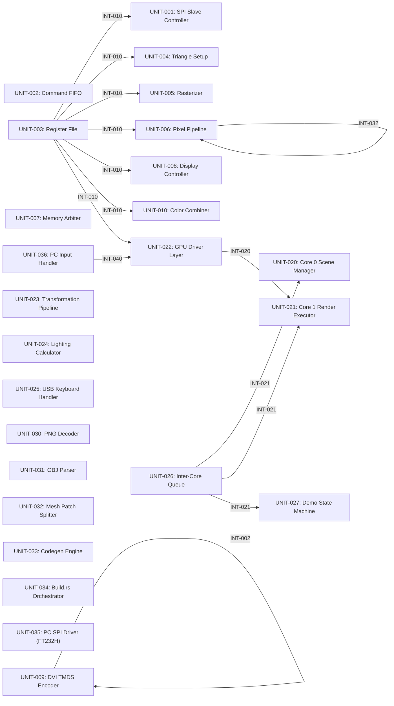

# Architecture

*A hobby 3D graphics processor on a small FPGA, named after the PS2 Graphics Synthesizer.*

## System Description

pico-gs is an educational/hobby 3D GPU implemented on the ICEpi Zero v1.3 development board (Lattice ECP5-25K FPGA, CABGA256) with 32 MiB of SDRAM (Winbond W9825G6KH-6).
It outputs 640x480 at 60 Hz as DVI on the board's HDMI port.

The GPU is driven over QSPI from a Raspberry Pi Pico 2 (RP2350, dual Cortex-M33) host.
The same host software also runs on a PC via an FT232H USB-to-SPI adapter for desktop debugging.
Two GPIO lines provide hardware flow control: one signals when the command FIFO is nearly full, the other delivers a VSYNC pulse for frame synchronization.

The framebuffer is RGB565, the Z-buffer is 16-bit unsigned, and the pixel pipeline supports two independent texture units per pixel in a single pass.
The pipeline is fixed-function, inspired by the Nintendo 64 RDP's programmable color combiner — `(A-B)*C+D` applied independently to RGB and alpha — with additional features including blue noise dithering, per-channel color grading LUTs, DOT3 bump mapping, octahedral UV wrapping, and stipple-pattern fragment discard for order-independent transparency without framebuffer reads.

## Design Philosophy

The architecture is a hybrid of two classic console GPUs: the PS2 Graphics Synthesizer's register-driven vertex submission model and the N64 RDP's fixed-function pixel pipeline.
Rendering is strictly immediate mode — no display lists, no tile-based deferred rendering.

The host handles all vertex transformation, lighting, back-face culling, and clipping in software (Rust, `no_std`, using the RP2350's hardware FPU).
The GPU handles rasterization, texturing, depth testing, color combining, and scanout.
This split keeps the FPGA fabric focused on per-pixel throughput while the host's dual cores manage scene complexity.

Fragment processing uses 10.8 fixed-point arithmetic throughout, matched to the ECP5's native 18x18 DSP multipliers.
Memory bandwidth is managed through a 4-way set-associative texture cache (>90% hit rate), early Z rejection before texture fetch, and burst-oriented scanline-order traversal.

## Component Interactions

The host submits triangles as a stream of 72-bit register writes over QSPI.
Each write carries a 7-bit register address and 64-bit data payload.
Per-vertex state (color, UVs, position) is accumulated in the register file (UNIT-003); the third vertex write triggers the hardware rasterizer.

The SPI slave (UNIT-001) feeds an asynchronous command FIFO (UNIT-002) that bridges the SPI clock domain to the 100 MHz core domain.
When the FIFO approaches capacity, the CMD_FULL GPIO tells the host to pause.

Triangle setup (UNIT-004) computes edge coefficients and performs backface culling.
The rasterizer (UNIT-005) walks the bounding box using edge-function increments, interpolating Z, two vertex colors, and two UV coordinate pairs per fragment.
The pixel pipeline (UNIT-006) performs early Z testing, dual-texture sampling through per-sampler caches, and feeds the color combiner (UNIT-010) whose `(A-B)*C+D` equation selects from texture colors, vertex colors, material constants, and a depth-derived fog term.
After optional alpha blending and ordered dithering, fragments are written to the double-buffered framebuffer in SDRAM.

A four-port fixed-priority memory arbiter (UNIT-007) manages all SDRAM traffic: display scanout (highest), framebuffer writes, Z-buffer access, and texture cache fills (lowest).
The display controller (UNIT-008) prefetches scanlines into a FIFO and drives the DVI/TMDS encoder (UNIT-009) for 640x480 output.
Frame presentation is double-buffered — the host writes to one framebuffer while the display controller scans out the other, swapping atomically at VSYNC.

---

<!-- syskit-arch-start -->
### Block Diagram

### Software Units

| Unit | Title | Purpose |
|------|-------|---------|
| UNIT-001 | SPI Slave Controller | Receives 72-bit SPI transactions and writes to register file |
| UNIT-002 | Command FIFO | Buffers GPU commands with flow control and provides autonomous boot-time command execution via pre-populated FIFO entries. |
| UNIT-003 | Register File | Stores GPU state and vertex data |
| UNIT-004 | Triangle Setup | Prepares triangle for rasterization |
| UNIT-005 | Rasterizer | Edge-walking rasterization engine |
| UNIT-006 | Pixel Pipeline | Depth range clipping, early Z-test, texture sampling, blending, framebuffer write |
| UNIT-007 | Memory Arbiter | Arbitrates SDRAM access between display and render |
| UNIT-008 | Display Controller | Scanline FIFO and display pipeline |
| UNIT-009 | DVI TMDS Encoder | TMDS encoding and differential output |
| UNIT-010 | Color Combiner | Pipelined programmable color combiner that produces a final fragment color from multiple input sources. |
| UNIT-020 | Core 0 Scene Manager | Scene graph management and animation |
| UNIT-021 | Core 1 Render Executor | Render command queue consumer |
| UNIT-022 | GPU Driver Layer | Platform-agnostic GPU register protocol and flow control, generic over SPI transport |
| UNIT-023 | Transformation Pipeline | MVP matrix transforms |
| UNIT-024 | Lighting Calculator | Gouraud shading calculations |
| UNIT-025 | USB Keyboard Handler | USB HID keyboard input processing |
| UNIT-026 | Inter-Core Queue | SPSC queue for render command dispatch (Core 0→Core 1 on RP2350; single-threaded equivalent on other platforms) |
| UNIT-027 | Demo State Machine | Demo selection and switching logic |
| UNIT-030 | PNG Decoder | PNG file loading, RGBA conversion, and texture format encoding (RGBA4444/BC1) |
| UNIT-031 | OBJ Parser | OBJ file parsing and geometry extraction |
| UNIT-032 | Mesh Patch Splitter | Mesh splitting with vertex/index limits |
| UNIT-033 | Codegen Engine | Rust source and binary data generation for compiled assets |
| UNIT-034 | Build.rs Orchestrator | Asset pipeline entry point |
| UNIT-035 | PC SPI Driver (FT232H) | SPI transport implementation for PC platform via Adafruit FT232H breakout board |
| UNIT-036 | PC Input Handler | Terminal keyboard input handling for the PC debug host platform. |
<!-- syskit-arch-end -->
