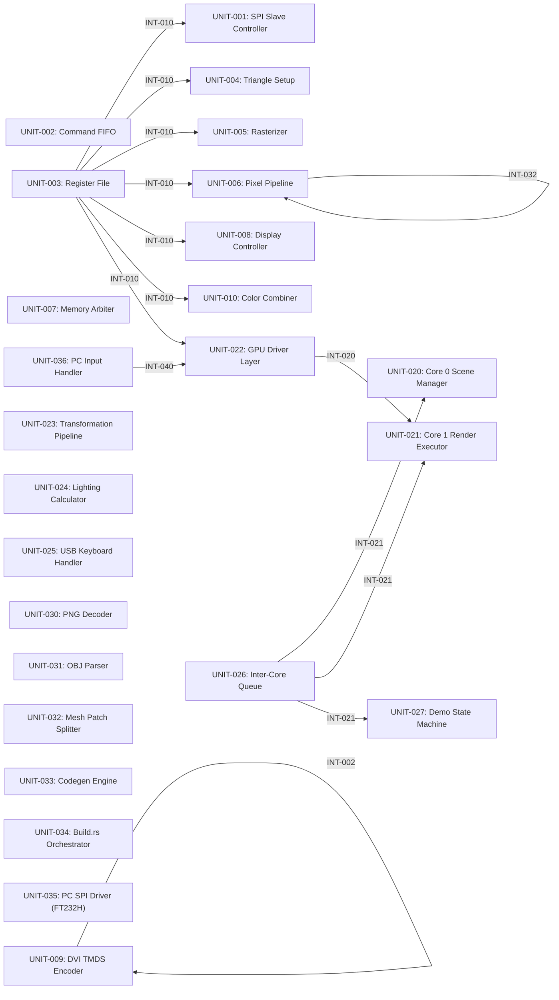

# Architecture

*Architecture overview for <system name>*

## System Description

<Describe the system at the highest level: what problem it solves, its primary
responsibilities, and its operational environment.>

## Design Philosophy

<Key architectural principles guiding the design: e.g., "data-flow driven",
"layered", "hardware abstraction via interfaces", etc.>

## Component Interactions

<Narrative description of how major components collaborate. Reference specific
units (UNIT-NNN) and interfaces (INT-NNN) where helpful.>

---

<!-- syskit-arch-start -->
### Block Diagram

### Software Units

| Unit | Title | Purpose |
|------|-------|---------|
| UNIT-001 | SPI Slave Controller | Receives 72-bit SPI transactions and writes to register file |
| UNIT-002 | Command FIFO | Buffers GPU commands with flow control and provides autonomous boot-time command execution via pre-populated FIFO entries. |
| UNIT-003 | Register File | Stores GPU state and vertex data |
| UNIT-004 | Triangle Setup | Prepares triangle for rasterization |
| UNIT-005 | Rasterizer | Edge-walking rasterization engine |
| UNIT-006 | Pixel Pipeline | Depth range clipping, early Z-test, texture sampling, blending, framebuffer write |
| UNIT-007 | Memory Arbiter | Arbitrates SDRAM access between display and render |
| UNIT-008 | Display Controller | Scanline FIFO and display pipeline |
| UNIT-009 | DVI TMDS Encoder | TMDS encoding and differential output |
| UNIT-010 | Color Combiner | Pipelined programmable color combiner that produces a final fragment color from multiple input sources. |
| UNIT-020 | Core 0 Scene Manager | Scene graph management and animation |
| UNIT-021 | Core 1 Render Executor | Render command queue consumer |
| UNIT-022 | GPU Driver Layer | Platform-agnostic GPU register protocol and flow control, generic over SPI transport |
| UNIT-023 | Transformation Pipeline | MVP matrix transforms |
| UNIT-024 | Lighting Calculator | Gouraud shading calculations |
| UNIT-025 | USB Keyboard Handler | USB HID keyboard input processing |
| UNIT-026 | Inter-Core Queue | SPSC queue for render command dispatch (Core 0→Core 1 on RP2350; single-threaded equivalent on other platforms) |
| UNIT-027 | Demo State Machine | Demo selection and switching logic |
| UNIT-030 | PNG Decoder | PNG file loading, RGBA conversion, and texture format encoding (RGBA4444/BC1) |
| UNIT-031 | OBJ Parser | OBJ file parsing and geometry extraction |
| UNIT-032 | Mesh Patch Splitter | Mesh splitting with vertex/index limits |
| UNIT-033 | Codegen Engine | Rust source and binary data generation for compiled assets |
| UNIT-034 | Build.rs Orchestrator | Asset pipeline entry point |
| UNIT-035 | PC SPI Driver (FT232H) | SPI transport implementation for PC platform via Adafruit FT232H breakout board |
| UNIT-036 | PC Input Handler | Terminal keyboard input handling for the PC debug host platform. |
<!-- syskit-arch-end -->
