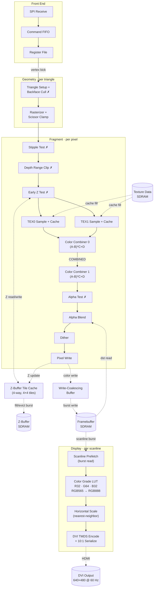
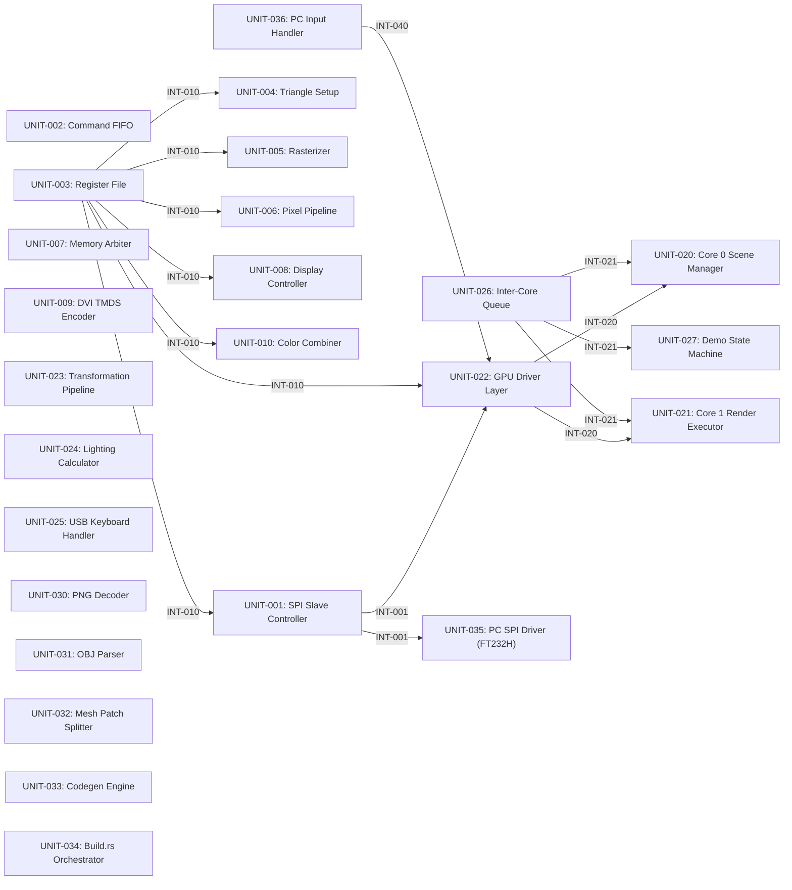

# Architecture

*A hobby 3D graphics processor on a small FPGA, named after the PS2 Graphics Synthesizer.*

## System Description

pico-gs is an educational/hobby 3D GPU implemented on the ICEpi Zero v1.3 development board (Lattice ECP5-25K FPGA, CABGA256) with 32 MiB of SDRAM (Winbond W9825G6KH-6).
It outputs 640x480 at 60 Hz as DVI on the board's HDMI port.

The GPU is driven over SPI from a Raspberry Pi Pico 2 (RP2350, dual Cortex-M33) host.
The same host software also runs on a PC via an FT232H USB-to-SPI adapter for desktop debugging.
Three GPIO lines provide hardware status to the host: CMD_FULL warns when the command FIFO is nearly full (host must pause writes), CMD_EMPTY indicates the FIFO is empty and no command is executing (safe to issue register reads), and VSYNC delivers a pulse for frame synchronization.

The framebuffer is RGB565 in 4×4 block-tiled layout, the Z-buffer is 16-bit unsigned (also block-tiled), and the pixel pipeline supports two independent texture units per pixel in a single pass.
Render targets are power-of-two per axis (non-square permitted) and share the same tiled format as textures, enabling completed render targets to be sampled directly as texture sources with no copy or format conversion.
The pipeline is fixed-function, inspired by the Nintendo 64 RDP's programmable color combiner — `(A-B)*C+D` applied independently to RGB and alpha — with additional features including blue noise dithering, per-channel color grading LUTs, DOT3 bump mapping, octahedral UV wrapping, and stipple-pattern fragment discard for order-independent transparency without framebuffer reads.

## Design Philosophy

The architecture is a hybrid of two classic console GPUs: the PS2 Graphics Synthesizer's register-driven vertex submission model and the N64 RDP's fixed-function pixel pipeline.
Rendering is strictly immediate mode — no display lists, no tile-based deferred rendering.

The host handles all vertex transformation, lighting, back-face culling, and clipping in software (Rust, `no_std`, using the RP2350's hardware FPU).
The GPU handles rasterization, texturing, depth testing, color combining, and scanout.
This split keeps the FPGA fabric focused on per-pixel throughput while the host's dual cores manage scene complexity.

Fragment processing uses Q4.12 signed fixed-point arithmetic (16-bit) as the pipeline-wide format, with colors normalized to 0.0–1.0.
All UNORM inputs — vertex colors, material constants, and texture samples — are promoted to Q4.12 at pipeline entry; output converts back to UNORM after optional dithering.
The signed representation naturally handles the `(A-B)` subtraction in the color combiner, and the 3-bit integer headroom above 1.0 (range up to ~8.0) accommodates additive blending without premature saturation.
The 12 fractional bits reduce accumulated quantization error through chained combiner stages and alpha blending, preserving gradient fidelity in dark tones.
Alpha blending promotes the framebuffer's UNORM value to Q4.12 before blending; the result follows the normal dither-and-write path.
The 16-bit operands fit within the ECP5's native 18×18 DSP multipliers; bilinear texture filtering still uses the 9×9 DSP sub-mode, as its inputs (≤8-bit texels and fractional UV weights) remain narrow enough to pack two multiplies per slice.
Memory bandwidth is managed through native 16-bit pixel addressing (one SDRAM column per RGB565 or Z16 value), a 4-way set-associative texture cache (>90% hit rate), a Z-buffer tile cache (4-way, 16 sets, 4×4 tiles, 85–95% hit rate), early Z rejection before texture fetch, and write-coalescing burst output.

## Component Interactions

The host submits triangles as a stream of 72-bit register writes over SPI.
Each write carries a 7-bit register address and 64-bit data payload.
Per-vertex state (color, UVs, position) is accumulated in the register file (UNIT-003); the third vertex write triggers the hardware rasterizer.

The SPI slave (UNIT-001) feeds a 512-entry asynchronous command FIFO (UNIT-002, 2 EBR blocks, 72 bits wide) that bridges the SPI clock domain to the 100 MHz core domain.
Commands execute in strict FIFO order; a long-running operation such as rasterizing a large triangle stalls all subsequent commands until it completes.
At 62.5 MHz SPI this provides approximately 590 µs of host-side buffering (~170 triangles), decoupling the host's SPI burst rate from the GPU's variable per-command execution time.
When the FIFO approaches capacity, the CMD_FULL GPIO tells the host to pause.
The CMD_EMPTY GPIO indicates the FIFO is drained and no command is executing, which the host must check before issuing a register read (reads bypass the FIFO and require an idle register file).

Triangle setup (UNIT-004) computes edge coefficients and performs backface culling.
The rasterizer (UNIT-005) walks the bounding box in 4×4 tile order — aligned with the surface tiling and Z-cache block size — using edge-function increments, interpolating Z, two vertex colors, and two UV coordinate pairs per fragment.
All pixels within a tile are processed before advancing to the next, maximizing Z-cache locality.
The pixel pipeline (UNIT-006) performs early Z testing and dual-texture sampling through per-sampler caches.
The color combiner (UNIT-010) is a two-stage pipeline running at one pixel per clock: each stage evaluates `(A-B)*C+D` independently for RGB and alpha, selecting from texture colors, two interpolated vertex colors (SHADE0 for diffuse, SHADE1 for specular), per-draw-call constant colors, and a combined-output feedback path.
Stage 0's output feeds stage 1 via the COMBINED source, enabling multi-texture blending, fog, and specular-add in a single pass; for simple single-equation rendering, stage 1 is configured as a pass-through.
After optional alpha blending and ordered dithering, fragments are written to the double-buffered framebuffer in SDRAM.

A four-port fixed-priority memory arbiter (UNIT-007) manages all SDRAM traffic: display scanout (highest), framebuffer writes, Z-buffer access, and texture cache fills (lowest).
The display controller (UNIT-008) reads from the block-tiled framebuffer surface, applies an optional color-grade LUT, stretches the image to 640×480 using nearest-neighbor horizontal scaling, and drives the DVI/TMDS encoder (UNIT-009).
The render framebuffer may be smaller than the display resolution (typically 512×480 or 256×240); the display controller stretches horizontally and optionally line-doubles to fill the 640×480 output.
Frame presentation is double-buffered — the host writes to one framebuffer while the display controller scans out the other, swapping atomically at VSYNC.

## Fragment Pipeline

The stages below trace a fragment from SPI command to DVI output.
Stages marked **✗** can kill the fragment, skipping all subsequent stages and SDRAM traffic.



After framebuffer write, the display controller (UNIT-008) prefetches scanlines via burst reads from SDRAM, applies the optional color-grade LUT (three per-channel 1D tables producing RGB888 — see REQ-006.03), scales horizontally to 640 pixels (see [Display Scaling](#display-scaling)), and feeds the DVI TMDS encoder (UNIT-009) at 25 MHz pixel clock.
The LUT is double-buffered in EBR and auto-loaded from SDRAM via DMA during vblank.

### Per-fragment data lanes

Each column shows a value's lifetime from production (first ●) to last consumption (last ●).

| Stage | x, y | z | shade0 | shade1 | uv | tex0 | tex1 | comb | color | SDRAM access |
|---|:-:|:-:|:-:|:-:|:-:|:-:|:-:|:-:|:-:|---|
| Rasterizer | ● | ● | ● | ● | ● | | | | | |
| Stipple Test | ● | ● | ● | ● | ● | | | | | |
| Depth Range Clip | ● | ● | ● | ● | ● | | | | | |
| Early Z Test | ● | ● | ● | ● | ● | | | | | Z-buffer read |
| Texture Sample | ● | ● | ● | ● | ● | ● | ● | | | Texture read (cache miss) |
| Color Combiner 0 | ● | ● | ● | ● | | ● | ● | ● | | |
| Color Combiner 1 | ● | ● | ● | ● | | ● | ● | ● | ● | |
| Alpha Test | ● | ● | | | | | | | ● | |
| Alpha Blend | ● | ● | | | | | | | ● | Framebuffer read (dst) |
| Dither | ● | ● | | | | | | | ● | |
| Pixel Write | ● | ● | | | | | | | ● | FB write, Z write |

**Widths:** x, y are S12.4 (32 bits total); z is 16-bit unsigned; uv is 4 × Q4.12 (64 bits for both TEX0 + TEX1 coordinates); all colors (shade, tex, comb, color) are Q4.12 RGBA (4 × 16-bit = 64 bits).
Register-file values **CONST0**, **CONST1**, and **CC_MODE** are side inputs to the combiner, not per-fragment data.
After dither, color is truncated to RGB565 (16-bit) for framebuffer write.

## Host Interface

The FPGA's SPI slave accepts standard SPI Mode 0 at up to 62.5 MHz from the RP2350's hardware SPI peripheral, or 30 MHz from the FT232H MPSSE (PC debug path).
At 62.5 MHz, the 72-bit transaction format yields approximately 868K register writes per second — roughly 960 non-textured or 640 textured triangles per frame at 60 fps.
SPI bandwidth, not vertex compute, is the primary throughput bottleneck.

A future upgrade path widens the interface to quad SPI via the RP2350's PIO, using four data lines at 37.5 MHz for approximately 2M register writes per second (2.4x improvement) with only two additional GPIO pins.
The FPGA slave change is minimal: widening the shift register input from 1 to 4 bits.
The FT232H debug path would remain on standard SPI.

## Rendering Techniques

The color combiner's `(A-B)*C+D` equation, combined with dual texture units and two pipelined combiner stages, supports several classic rendering techniques in a single pass:

- **Textured Gouraud:** `TEX0 * SHADE0` — diffuse texture modulated by per-vertex lighting.
- **Lightmapping:** `TEX0 * TEX1` — diffuse texture (UV0) multiplied by a pre-computed lightmap (UV1).
  Unlike the N64 RDP, both texture units are sampled in a single pipeline pass with no throughput penalty.
- **Lightmap + dynamic fill light:** `TEX0 * TEX1 + SHADE0` — additive per-vertex contribution on top of lightmapped surfaces.
- **Specular highlight (two-stage):** Stage 0 computes `TEX0 * SHADE0` (diffuse); stage 1 adds the specular color via `COMBINED + SHADE1`.
  The host computes both diffuse and specular lighting per-vertex; the combiner composites them in a single pass.
- **Fog (two-stage):** Stage 0 computes lit/textured color; stage 1 blends COMBINED toward CONST1 (fog color) using vertex alpha as the fog factor.
- **Decal / solid color:** `TEX0 * ONE` or `CONST0 * ONE` — trivial pass-through configurations.

Multi-pass rendering extends the repertoire to environment mapping over lightmapped surfaces and similar effects that require more than two texture samples.

## Surface Tiling

All color buffers and Z-buffers use 4×4 block-tiled layout in SDRAM, matching the texture cache's native block format.
Pixels within each 4×4 block are stored in row-major order; blocks themselves are arranged in row-major order across the surface.
Surface dimensions must be power-of-two per axis (non-square permitted) — the tiled address calculation uses only shifts and masks, requiring no multiply hardware.

For a pixel at position (x, y) in a surface with width 2^WIDTH_LOG2:

```
block_x    = x >> 2
block_y    = y >> 2
local_x    = x & 3
local_y    = y & 3
block_idx  = (block_y << (WIDTH_LOG2 - 2)) | block_x
byte_addr  = base + block_idx * 32 + (local_y * 4 + local_x) * 2
```

This layout unifies framebuffers, Z-buffers, and textures: a completed render target can be bound directly as a texture source (format `RGB565` tiled) with no format conversion or copy.
The block-tiled layout also aligns with the texture cache's 4×4 block fetch unit, ensuring that render-target-as-texture sampling uses the same cache path as any other texture.

Because all blocks in a power-of-two surface are contiguous in SDRAM, the existing MEM_FILL command clears any render target with a single linear fill — no block-aware fill command is required.

## Render to Texture

The GPU supports rendering to off-screen power-of-two surfaces that can subsequently be sampled as textures.
FB_CONFIG specifies the active render target (color base, Z-base, and surface dimensions); the host reprograms it between passes.
A paired Z-buffer at Z_BASE always has the same dimensions as the color buffer.

Typical render-to-texture flow:

1. Write FB_CONFIG with the render target's base addresses and dimensions.
2. Clear color and Z via MEM_FILL (contiguous for any power-of-two surface).
3. Set scissor rectangle and render the off-screen scene.
4. Write FB_CONFIG back to the display framebuffer.
5. Write TEX0_CFG with the render target's base address, dimensions, and format (RGB565).
   This implicitly invalidates the texture cache for the sampler.
6. Render geometry that samples from the render target.
7. Write FB_DISPLAY to present the display framebuffer at VSYNC.

Since the display framebuffer is also a power-of-two tiled surface (typically 512×512), it can itself be bound as a texture source — enabling the front buffer to be sampled in a subsequent frame for effects such as motion blur or rear-view mirrors.

Self-referencing (sampling from the current render target while writing to it) is not supported.

## Display Scaling

The DVI output is fixed at 640×480 at 60 Hz.
The display framebuffer may be smaller than the display resolution: the display controller stretches the source image horizontally to fill 640 pixels per scanline.
Two display modes are supported:

| Mode | Source | Horizontal | Vertical | Use case |
|------|--------|------------|----------|----------|
| 512×480 | 512-wide surface, 480 active rows | 512→640 stretch | 1:1 row mapping | Default rendering |
| 256×240 | 256-wide surface, 240 active rows | 256→640 stretch | Line doubling (each row output twice) | Half-resolution / retro |

The framebuffer surface is always power-of-two (512×512 or 256×256).
In 512×480 mode, the bottom 32 rows of the 512×512 surface are not scanned out and may be left unused or repurposed by the host for small data.

Horizontal scaling uses nearest-neighbor interpolation via a Bresenham-style accumulator — no multiply hardware is required.
The scaling ratio for 512→640 is 4:5, producing a repeating 5-pixel pattern where one source pixel is doubled.
For 256→640 the ratio is 2:5.

Interpolation operates on UNORM8 values post color-grade LUT, ensuring that the LUT's tone mapping is applied before any pixel blending.

FB_DISPLAY latches the display mode fields (FB_WIDTH_LOG2, LINE_DOUBLE) atomically at VSYNC, independent of FB_CONFIG.
This allows the host to freely reprogram FB_CONFIG for render-to-texture passes during the frame without affecting the active scanout.

This approach mirrors classic console practice — many PS2 titles rendered at 512 pixels wide (a power-of-two convenient for the Graphics Synthesizer's block-based memory) and relied on the display output to scale to the television's native resolution.

## Memory System

### SDRAM Bus and Pixel Addressing

The GPU uses a single 16-bit SDRAM (Winbond W9825G6KH-6) at 100 MHz, providing a peak bandwidth of 200 MB/s.
This single bus is shared by four consumers in fixed-priority order: display scanout (highest), framebuffer writes, Z-buffer read/write, and texture cache fills (lowest).

Both the framebuffer (RGB565) and Z-buffer (16-bit depth) use **native 16-bit addressing**: each pixel occupies exactly one 16-bit SDRAM column.
This eliminates the waste of padding 16-bit values into 32-bit words — every SDRAM column transfer carries useful data.

Pixel and depth addresses are computed directly:

```
pixel_addr = FB_BASE + block_addr(x, y)    [16-bit word address]
z_addr     = Z_BASE  + block_addr(x, y)    [16-bit word address]
```

A 512×512 framebuffer occupies 512 KB; a double-buffered framebuffer plus Z-buffer totals ~1.5 MB, well within the 32 MiB SDRAM.

### Bandwidth Budget

| Consumer | Rate (512×480 @ 60 Hz) | Priority | Notes |
|---|---|---|---|
| Display scanout | ~30 MB/s | Highest | Burst reads, 1 word/pixel |
| FB color writes | Variable | 2 | Burst-coalesced |
| Z-buffer R/W | Variable | 3 | Cached (tile cache) |
| Texture fills | Variable | Lowest | Cached (texture cache) |

Display scanout consumes ~15% of peak bandwidth, leaving ~170 MB/s for rendering.

### Z-Buffer Tile Cache

The Z-buffer has the worst per-fragment bandwidth profile: every visible fragment requires a read-compare-conditional-write cycle on the same address.
A small on-chip cache absorbs this traffic, following industry precedent (NVIDIA GeForce 256, ATI HyperZ).

**Geometry:** 4-way set-associative, 16 sets.
Each cache line holds a 4×4 tile of 16-bit Z values (256 bits = 32 bytes), aligned with the surface tiling format.

**Behavior:**
1. **Hit:** Z value read from on-chip EBR in 1 cycle. If the fragment passes, the cached value is updated and the line marked dirty. Zero SDRAM traffic.
2. **Miss:** Dirty line evicted as a 16-word burst write; new line filled as a 16-word burst read (~44 cycles total, amortized over up to 16 subsequent hits).
3. **Write-back policy:** Dirty lines are written to SDRAM only on eviction or explicit end-of-frame flush (before buffer swap).

Expected hit rate is 85–95% depending on scene complexity and overdraw, reducing Z-buffer SDRAM traffic by 5–7×.
The cache controller reuses the same set-associative structure, XOR set indexing, and burst fill/evict FSM proven in the texture cache.

**Cost:** 4–5 EBR, ~300–400 LUTs.

### Burst Coalescing

A write-coalescing buffer sits between the rasterizer and the SDRAM arbiter.
When the rasterizer emits a run of adjacent pixels on the same scanline (or within the same 4×4 tile), the buffer collects them and issues a single SDRAM burst write rather than individual single-word transactions.

Within an active SDRAM row, sequential 16-bit writes deliver 1 word/cycle after the initial overhead, so a 16-pixel tile write completes in ~24 cycles (1.5 cycles/pixel) versus ~9 cycles per individual write.

**Cost:** ~100–150 LUTs, zero EBR (distributed RAM).

### EBR Budget

| Component | EBR | Notes |
|---|---|---|
| Texture cache (2 samplers) | 32 | 16 per sampler |
| Z-buffer tile cache | 4–5 | 4-way, 16 sets, 4×4 tiles |
| Command FIFO | 2 | 512×72 async CDC |
| Dither matrix | 1 | 16×16 blue noise |
| Color grading LUT | 1 | 128-entry RGB |
| Scanline FIFO | 1 | 1024×16 display |
| FB write buffer | 1 | Single-tile coalescing buffer |
| **Total** | **42–43** | **of 56 available (ECP5-25K)** |

### Throughput

With native 16-bit addressing, burst coalescing, and Z-buffer caching, the rasterizer sustains approximately 28–35 Mpixels/sec for typical triangle workloads — sufficient for >1× overdraw at 640×480 @ 60 Hz (18.4 Mpixels/sec visible).

---

<!-- syskit-arch-start -->
### Block Diagram



### Software Units

| Unit | Title | Purpose |
|------|-------|---------|
| UNIT-001 | SPI Slave Controller | Receives 72-bit SPI transactions and writes to register file |
| UNIT-002 | Command FIFO | Buffers GPU commands with flow control and provides autonomous boot-time command execution via pre-populated FIFO entries. |
| UNIT-003 | Register File | Stores GPU state and vertex data |
| UNIT-004 | Triangle Setup | Prepares triangle for rasterization |
| UNIT-005 | Rasterizer | Edge-walking rasterization engine |
| UNIT-006 | Pixel Pipeline | Stipple test, depth range clipping, early Z-test, texture sampling, and format promotion to Q4.12 |
| UNIT-007 | Memory Arbiter | Arbitrates SDRAM access between display and render |
| UNIT-008 | Display Controller | Scanline FIFO and display pipeline |
| UNIT-009 | DVI TMDS Encoder | TMDS encoding and differential output |
| UNIT-010 | Color Combiner | Two-stage pipelined programmable color combiner that produces a final fragment color from multiple input sources. |
| UNIT-020 | Core 0 Scene Manager | Scene graph management and animation |
| UNIT-021 | Core 1 Render Executor | Render command queue consumer |
| UNIT-022 | GPU Driver Layer | Platform-agnostic GPU register protocol and flow control, generic over SPI transport |
| UNIT-023 | Transformation Pipeline | MVP matrix transforms |
| UNIT-024 | Lighting Calculator | Gouraud shading calculations |
| UNIT-025 | USB Keyboard Handler | USB HID keyboard input processing |
| UNIT-026 | Inter-Core Queue | SPSC queue for render command dispatch (Core 0→Core 1 on RP2350; single-threaded equivalent on other platforms) |
| UNIT-027 | Demo State Machine | Demo selection and switching logic |
| UNIT-030 | PNG Decoder | PNG file loading, RGBA conversion, and texture format encoding (RGBA4444/BC1) |
| UNIT-031 | OBJ Parser | OBJ file parsing and geometry extraction |
| UNIT-032 | Mesh Patch Splitter | Mesh splitting with vertex/index limits |
| UNIT-033 | Codegen Engine | Rust source and binary data generation for compiled assets |
| UNIT-034 | Build.rs Orchestrator | Asset pipeline entry point |
| UNIT-035 | PC SPI Driver (FT232H) | SPI transport implementation for PC platform via Adafruit FT232H breakout board |
| UNIT-036 | PC Input Handler | Terminal keyboard input handling for the PC debug host platform. |
<!-- syskit-arch-end -->
