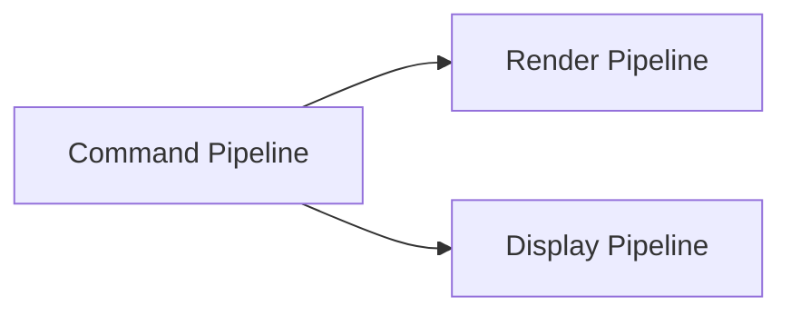
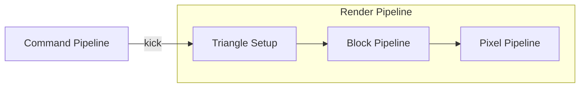
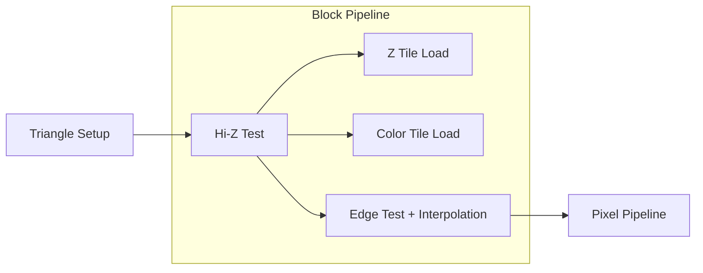
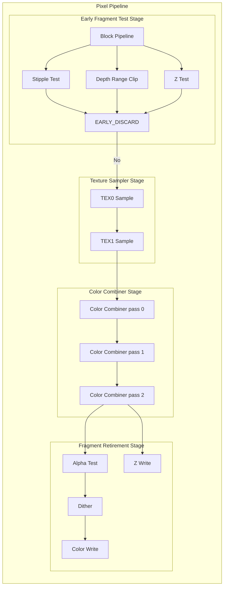
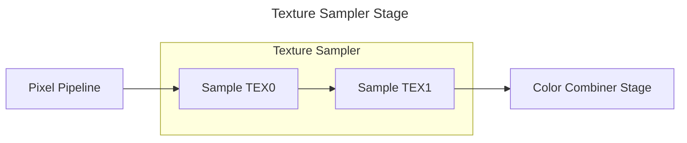
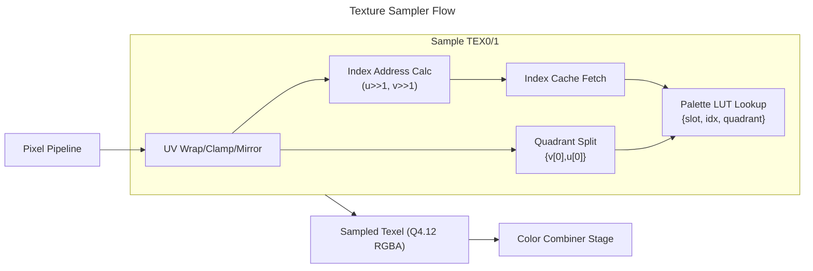
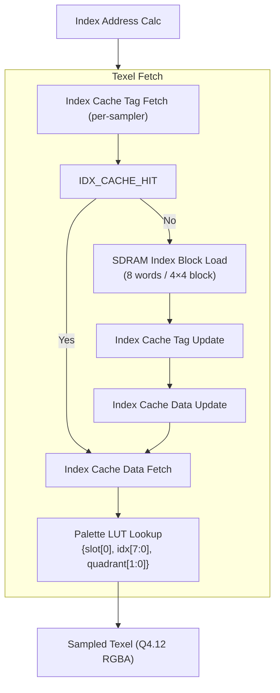
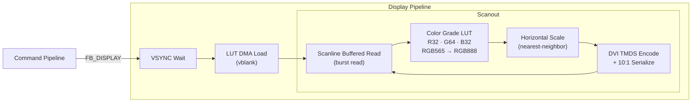
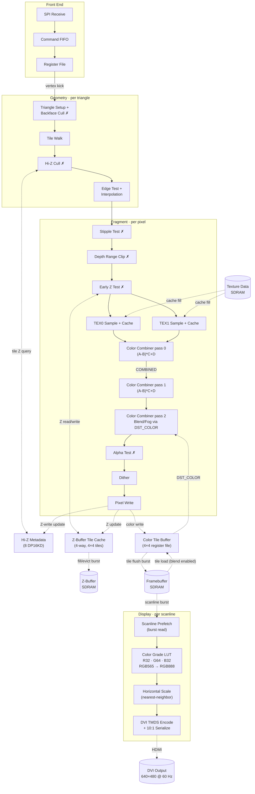
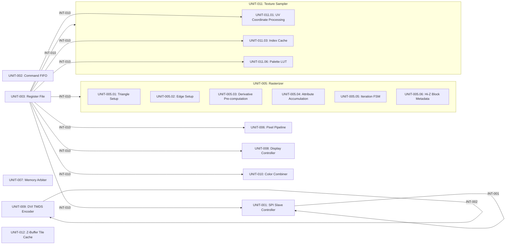

# Architecture

*A hobby 3D graphics processor on a small FPGA, named after the PS2 Graphics Synthesizer.*

## System Description

pico-gs is an educational/hobby 3D GPU implemented on the ICEpi Zero v1.3 development board (Lattice ECP5-25K FPGA, CABGA256) with 32 MiB of SDRAM (Winbond W9825G6KH-6).
It outputs 640x480 at 60 Hz as DVI on the board's HDMI port.

The GPU is driven over SPI by an external host that writes 72-bit register-write transactions per INT-012.
The reference host application is pico-racer (https://github.com/londey/pico-racer), which runs on a Raspberry Pi Pico 2 (RP2350) or on a PC via an FT232H USB-to-SPI adapter.
Three GPIO lines provide hardware status to the host: CMD_FULL warns when the command FIFO is nearly full (host must pause writes), CMD_EMPTY indicates the FIFO is empty and no command is executing (safe to issue register reads), and VSYNC delivers a pulse for frame synchronization.

The framebuffer is RGB565 in 4×4 block-tiled layout, the Z-buffer is 16-bit unsigned (also block-tiled), and the pixel pipeline supports two independent texture units per pixel in a single pass.
Render targets are power-of-two per axis (non-square permitted) and share the same tiled format as textures, enabling completed render targets to be sampled directly as texture sources with no copy or format conversion.
The pipeline is fixed-function, inspired by the Nintendo 64 RDP's programmable color combiner — `(A-B)*C+D` applied independently to RGB and alpha — with additional features including blue noise dithering, per-channel color grading LUTs, DOT3 bump mapping, octahedral UV wrapping, and stipple-pattern fragment discard for order-independent transparency without framebuffer reads.

## Design Philosophy

The architecture is a hybrid of two classic console GPUs: the PS2 Graphics Synthesizer's register-driven vertex submission model and the N64 RDP's fixed-function pixel pipeline.
Rendering is strictly immediate mode — no display lists, no tile-based deferred rendering.

The external host handles all vertex transformation, lighting, back-face culling, and clipping in software.
The GPU handles rasterization, texturing, depth testing, color combining, and scanout.
This split keeps the FPGA fabric focused on per-pixel throughput while the host manages scene complexity.

Fragment processing uses Q4.12 signed fixed-point arithmetic (16-bit) as the pipeline-wide format, with colors normalized to 0.0–1.0.
All UNORM inputs — vertex colors, material constants, and texture samples — are promoted to Q4.12 at pipeline entry; output converts back to UNORM after optional dithering.
The signed representation naturally handles the `(A-B)` subtraction in the color combiner, and the 3-bit integer headroom above 1.0 (range up to ~8.0) accommodates additive blending without premature saturation.
The 12 fractional bits reduce accumulated quantization error through chained combiner stages and alpha blending, preserving gradient fidelity in dark tones.
The destination pixel is read from the color tile buffer (promoted from RGB565 to Q4.12) and supplied as the DST_COLOR source operand, available to all three combiner passes.
Alpha blending conventionally uses pass 2, mapping the selected blend mode directly to the `(A-B)*C+D` equation, but the hardware does not restrict DST_COLOR to any particular pass.
The result follows the normal dither-and-write path through the tile buffer.
The 16-bit operands fit within the ECP5's native 18×18 DSP multipliers.
Memory bandwidth is managed through native 16-bit pixel addressing (one SDRAM column per RGB565 or Z16 value), a per-sampler index cache (UNIT-011.03; direct-mapped, 32 sets × 16 indices/line, 1 DP16KD each) backed by a shared 2-slot palette LUT (UNIT-011.06; 4 PDPW16KD EBR, addressed by `{slot, index, quadrant}`), a Z-buffer tile cache (UNIT-012; 4-way, 16 sets, 4×4 tiles, 85–95% hit rate), early Z rejection before texture fetch, and write-coalescing burst output.

## Execution Model

### High Level Functional Blocks

The GPU is organized into a hierarchy of pipelines and components:


```mermaid
flowchart LR
    CMD_PIPE["Command Pipeline"]
    RENDER_PIPE["Render Pipeline"]
    DISPLAY_PIPE["Display Pipeline"]

    CMD_PIPE --> RENDER_PIPE

    CMD_PIPE --> DISPLAY_PIPE
```

#### Command Pipeline

The command pipeline receives register reads and writes from the host, queues them in a FIFO, and dispatches them to the register file.
The register file accumulates per-vertex state; the third vertex write triggers Triangle Setup.

#### Render Pipeline

The render pipeline executes the core rendering algorithm: triangle setup, rasterization, texturing, depth testing, and color combining.
The pipeline is initiated when the Command Pipeline pushes a vertex that kicks off triangle setup; the pipeline then runs autonomously until the triangle is fully rendered, at which point it waits for the next vertex kick.

The render pipeline itself is divided into several stages:


```mermaid
flowchart LR
    CMD_PIPE["Command Pipeline"]

    subgraph RENDER_PIPE["Render Pipeline"]
        SETUP["Triangle Setup"]
        BLOCK["Block Pipeline"]
        PIXEL["Pixel Pipeline"]

        SETUP --> BLOCK --> PIXEL
    end

    CMD_PIPE --> |kick| SETUP
```

##### Triangle Setup

Triangle setup computes edge coefficients for rasterization and performs back-face culling.
It then walks the triangle's bounding box in 4×4 tile order, aligned with the surface tiling and Z-cache block size, using incremental derivative-based traversal.

##### Block Pipeline

The block pipeline processes one 4×4 tile of fragments at a time.
For each tile, it performs a hierarchical Z test against the Hi-Z metadata.
If the tile passes, it loads the Z-buffer and color tile buffer entries for the tile, avoiding per-fragment cache tag checks.
It then runs edge tests to determine coverage and interpolates per-fragment data (Z, Q, two vertex colors, two UV coordinate pairs) for the Pixel Pipeline.


```mermaid
flowchart LR
    SETUP["Triangle Setup"]

    subgraph BLOCK["Block Pipeline"]
        HIZ["Hi-Z Test"]
        PREFETCH_Z["Z Tile Load"]
        PREFETCH_COLOR["Color Tile Load"]
        EDGE["Edge Test + Interpolation"]

        HIZ --> EDGE
        HIZ --> PREFETCH_Z
        HIZ --> PREFETCH_COLOR
    end

    SETUP --> HIZ

    PIXEL["Pixel Pipeline"]

    EDGE --> PIXEL
```

##### Pixel Pipeline

The pixel pipeline performs stipple and depth range tests, early Z testing, dispatches texture fetch requests to the texture units, evaluates the color combiner, applies alpha test and dithering, and issues pixel write requests to the tile buffer.

The pixel pipeline has four independent stages: early fragment test, texture sampling, color combining, and fragment retirement.
The current throughput target is 4 cycles per fragment (25 Mfragments/sec at 100 MHz), driven by the 3-pass color combiner schedule.
A longer-term goal is to pipeline each stage independently, which would allow stages to overlap and increase sustained throughput.


```mermaid
flowchart TB
    BLOCK["Block Pipeline"]

    subgraph PIXEL["Pixel Pipeline"]
        direction TB
        subgraph Z_TEST_STAGE["Early Fragment Test Stage"]
            direction LR
            STIPPLE["Stipple Test"]
            ZRC["Depth Range Clip"]
            Z_TEST["Z Test"]
            EARLY_DISCARD@{shape=diamond, label="Early Fragment Kill"}

            BLOCK --> STIPPLE --> EARLY_DISCARD
            BLOCK --> ZRC --> EARLY_DISCARD
            BLOCK --> Z_TEST --> EARLY_DISCARD
        end

        subgraph TEX_STAGE["Texture Sampler Stage"]
            direction LR
            TEX0["TEX0 Sample"]
            TEX1["TEX1 Sample"]

            TEX0 --> TEX1
        end

        EARLY_DISCARD -- No --> TEX0

        subgraph CC_STAGE["Color Combiner Stage"]
            direction LR
            CC0["Color Combiner pass 0"]
            CC1["Color Combiner pass 1"]
            CC2["Color Combiner pass 2"]

            CC0 --> CC1 --> CC2
        end

        subgraph RETIREMENT_STAGE["Fragment Retirement Stage"]
            direction LR
            A_TEST["Alpha Test"]
            DITH["Dither"]
            COLOR_WRITE["Color Write"]
            Z_WRITE["Z Write"]
        end

        TEX1 --> CC0
        CC2 --> A_TEST --> DITH --> COLOR_WRITE
        CC2 --> Z_WRITE
    end

```

The color tile buffer is a pair of 4×4 register files (16 RGB565 entries each), effectively a two-tile cache: one tile is actively drawn while the other is being read from or written to SDRAM via burst transfers.
The tile is always loaded at block entry (not only when blending is enabled), ensuring all color buffer accesses use burst mode.
It supplies DST_COLOR as a source to all color combiner passes and is flushed back as a 16-word burst write at block exit.

##### Texture Pipeline

The texture sampler stage first samples TEX0 and then samples TEX1.
The same sampler hardware is used for both textures but with separate L1 caches for each.
The two samples run back-to-back with no gap but also no parallelism — while one sample is waiting on a cache miss or SDRAM access, the other sample cannot proceed.

###### Texture Sampling Order


```mermaid
---
title: Texture Sampler Stage
---
flowchart LR
    PIXEL["Pixel Pipeline"]

    subgraph TEX_STAGE["Texture Sampler"]
        TEX0_SAMPLE["Sample TEX0"]
        TEX1_SAMPLE["Sample TEX1"]

        TEX0_SAMPLE --> TEX1_SAMPLE
    end

    PIXEL --> TEX0_SAMPLE

    CC_STAGE["Color Combiner Stage"]

    TEX1_SAMPLE --> CC_STAGE
```


####### Texture Sampling Flow


```mermaid
---
title: Texture Sampler Flow
---
flowchart LR
    PIXEL["Pixel Pipeline"]

    subgraph TEX_STAGE["Sample TEX0/1"]
        UV_WRAP["UV Wrap/Clamp/Mirror"]
        QUAD_SPLIT["Quadrant Split\n{v[0],u[0]}"]
        IDX_ADDR["Index Address Calc\n(u>>1, v>>1)"]
        IDX_FETCH["Index Cache Fetch"]
        PAL_LUT["Palette LUT Lookup\n{slot, idx, quadrant}"]

        UV_WRAP --> QUAD_SPLIT
        UV_WRAP --> IDX_ADDR --> IDX_FETCH --> PAL_LUT
        QUAD_SPLIT --> PAL_LUT
    end

    TEX_SAMPLE_OUT["Sampled Texel (Q4.12 RGBA)"]
    CC_STAGE["Color Combiner Stage"]

    PIXEL --> UV_WRAP

    TEX_STAGE --> TEX_SAMPLE_OUT --> CC_STAGE
```

###### Texture Fetch Flow


```mermaid
flowchart TB
    IDX_ADDR["Index Address Calc"]

    subgraph TEX_FETCH["Texel Fetch"]
        IDX_TAG_FETCH["Index Cache Tag Fetch (per-sampler)"]
        IDX_CACHE_HIT@{shape=diamond, label="Index Cache Hit?"}
        IDX_DATA_FETCH["Index Cache Data Fetch"]
        IDX_TAG_UPDATE["Index Cache Tag Update"]
        IDX_DATA_UPDATE["Index Cache Data Update"]
        SDRAM_IDX["SDRAM Index Block Load\n(8 words / 4×4 block)"]

        PAL_LUT["Palette LUT Lookup\n{slot[0], idx[7:0], quadrant[1:0]}"]

        IDX_TAG_FETCH --> IDX_CACHE_HIT
        IDX_CACHE_HIT -- Yes --> IDX_DATA_FETCH
        IDX_CACHE_HIT -- No --> SDRAM_IDX
        SDRAM_IDX --> IDX_TAG_UPDATE --> IDX_DATA_UPDATE --> IDX_DATA_FETCH
        IDX_DATA_FETCH --> PAL_LUT
    end

    TEX_SAMPLE_OUT["Sampled Texel (Q4.12 RGBA)"]

    IDX_ADDR --> TEX_FETCH
    PAL_LUT --> TEX_SAMPLE_OUT
```

#### Display Pipeline

The display pipeline runs in parallel with the render pipeline, reading the front buffer for scanout, performing color grading, resolution scaling, and generating the DVI output signal.


```mermaid
flowchart LR
    COMMAND_PIPE["Command Pipeline"]

    subgraph DISPLAY_PIPE["Display Pipeline"]
        VSYNC["VSYNC Wait"]
        LUT_LOAD["LUT DMA Load<br/>(vblank)"]

        subgraph SCANOUT["Scanout"]
            SCAN["Scanline Buffered Read<br/>(burst read)"]
            CLUT["Color Grade LUT<br/>R32 · G64 · B32<br/>RGB565 → RGB888"]
            HSCALE["Horizontal Scale<br/>(nearest-neighbor)"]
            TMDS["DVI TMDS Encode<br/>+ 10:1 Serialize"]

            SCAN --> CLUT --> HSCALE --> TMDS
        end

        VSYNC --> LUT_LOAD --> SCAN

        TMDS --> SCAN
    end

    COMMAND_PIPE --> |"FB_DISPLAY"| VSYNC
```


## Verification Strategy

The project uses a two-tier verification model with clearly separated responsibilities.

### Tier 1: Digital Twin (gs-twin) — Algorithmic Oracle

A bit-accurate, transaction-level Rust model of the GPU pipeline lives at `integration/gs-twin/`.
It models the register-write interface, integer rasterizer, and full pixel pipeline — everything from SPI register decode through framebuffer write — producing golden reference framebuffers that the RTL's output must match exactly at the RGB565 pixel level.

The twin answers: **"what should the output be?"**

Its role is algorithmic correctness: the rustdoc on each type and function is the authoritative design specification for the corresponding RTL module.
All fixed-point formats, bit widths, rounding behavior, and overflow conventions match the RTL exactly.

The twin is deliberately *not* cycle-accurate and does not model pipeline timing, valid/ready handshaking, stall propagation, cache miss penalties, or SDRAM arbitration contention.
These are hardware implementation concerns owned by the RTL and verified by Verilator.

For the module-to-RTL mapping, see `CLAUDE.md` (module mapping table) and the individual component twin crates under `twin/components/*/`.

### Tier 2: Verilator — Cycle-Accurate Verification

Verilator testbenches own all cycle-level concerns: pipeline stall propagation, backpressure handshaking, cache miss/evict timing, SDRAM arbitration, and clock-domain crossings.

Verilator answers: **"does the hardware produce the right answer with correct timing?"**

Both the Rust twin and Verilator testbenches consume the same `.hex` register-write scripts.
The `gs-twin-cli` binary renders scripts to PNG and compares against Verilator framebuffer dumps — any pixel mismatch is a real bug.
Component-level Verilator testbenches additionally verify RTL output against DT-generated test vectors for per-module correctness.

## Component Interactions

The host submits triangles as a stream of 72-bit register writes over SPI.
Each write carries a 7-bit register address and 64-bit data payload.
Per-vertex state (color, UVs, position) is accumulated in the register file (UNIT-003); the third vertex write triggers the hardware rasterizer.

The SPI slave (UNIT-001) feeds a 512-entry asynchronous command FIFO (UNIT-002, 2 EBR blocks, 72 bits wide) that bridges the SPI clock domain to the 100 MHz core domain.
Commands execute in strict FIFO order; a long-running operation such as rasterizing a large triangle stalls all subsequent commands until it completes.
At 62.5 MHz SPI this provides approximately 590 µs of host-side buffering (~170 triangles), decoupling the host's SPI burst rate from the GPU's variable per-command execution time.
When the FIFO approaches capacity, the CMD_FULL GPIO tells the host to pause.
The CMD_EMPTY GPIO indicates the FIFO is drained and no command is executing, which the host must check before issuing a register read (reads bypass the FIFO and require an idle register file).

Triangle setup (UNIT-005.01) computes edge coefficients and performs backface culling.
The rasterizer (UNIT-005) walks the bounding box in 4×4 tile order — aligned with the surface tiling and Z-cache block size — using incremental derivative-based traversal with 8 MULT18X18D DSP blocks (see UNIT-005 DSP Budget table for breakdown).
It interpolates Z, Q (1/W), two vertex colors, and two UV coordinate pairs (S×Q, T×Q perspective projections at vertices), then applies perspective correction internally using two dedicated reciprocal modules backed by ECP5 DP16KD block RAMs: one for the triangle-setup inv_area computation (`raster_recip_area.sv`, 36×512 mode, UQ4.14 output) and one for per-pixel 1/Q computation (`raster_recip_q.sv`, 18×1024 mode, UQ4.14 output).
A compile-time configurable register FIFO (default depth 2, ~730 bits wide) between setup and iteration enables triangle N+1 setup to overlap with triangle N iteration.
Four dedicated MULT18X18D blocks compute true U = S×(1/Q) and V = T×(1/Q) for both texture units.
The per-pixel level-of-detail (LOD) is derived from Q via CLZ and emitted on the fragment bus as `frag_lod` (UQ4.4).
All pixels within a tile are processed before advancing to the next, maximizing Z-cache locality.
The texture sampler (UNIT-011) performs dual-texture sampling; it receives true perspective-correct U, V coordinates directly from the rasterizer, applies wrap/clamp/mirror UV processing (UNIT-011.01) and extracts the 2-bit quadrant `{v[0],u[0]}`, fetches the 8-bit palette index from the per-sampler half-resolution index cache (UNIT-011.03), and looks up the selected quadrant's UQ1.8 RGBA color from the shared 2-slot palette LUT (UNIT-011.06), returning Q4.12 RGBA texel data to the pixel pipeline.
Palette slots are pre-loaded from SDRAM via the PALETTEn registers using an internal 3-way arbiter (palette slot 0 load, palette slot 1 load, index cache fill) that drives the same SDRAM Port 3 used by the index cache.
Cache misses trigger a short 8-word SDRAM burst to fill a 4×4 index block.
The pixel pipeline (UNIT-006) performs early Z testing, dispatches texture fetch requests to UNIT-011, and receives decoded Q4.12 texel data in return; it receives true perspective-correct U, V coordinates and frag_lod directly from the rasterizer — no per-pixel division is performed in the pixel pipeline.
The color combiner (UNIT-010) is a single time-multiplexed instance that evaluates `(A-B)*C+D` independently for RGB and alpha, executing up to three passes per fragment within a 4-cycle/fragment throughput target.
Pass 0 and pass 1 replicate the prior two-stage behavior: pass 0's output feeds pass 1 via the COMBINED source, enabling multi-texture blending, fog, and specular-add; for simple single-equation rendering, pass 1 is configured as a pass-through.
The DST_COLOR source (destination pixel from the on-chip color tile buffer) is available to all three passes.
Pass 2 conventionally implements alpha blending and fog by mapping the selected blend mode to the same `(A-B)*C+D` equation, but DST_COLOR can be selected in any pass for custom effects.
The color tile buffer (a 4×4, 16×16-bit register file) holds the current destination tile, pre-fetched from SDRAM at the start of each tile when blending is enabled, and flushed back as a 16-word burst write at tile exit.
After pass 2 and ordered dithering, fragments are written through the tile buffer to the double-buffered framebuffer in SDRAM.

The Z-buffer tile cache (UNIT-012) is an independent component that sits between the pixel pipeline and the SDRAM arbiter: it caches 4×4 tiles of 16-bit Z values in DP16KD BRAM (4-way, 16 sets, write-back), owns the per-tile uninitialized flag array (16,384 1-bit flags in DP16KD) for lazy-fill tracking, and supplies Z-read results and accepts Z-write requests from UNIT-006 while managing fill/evict bursts to SDRAM independently via arbiter port 2.
A four-port fixed-priority memory arbiter (UNIT-007) manages all SDRAM traffic: display scanout (highest), framebuffer writes, Z-buffer tile cache access, and texture cache fills (lowest).
The display controller (UNIT-008) reads from the block-tiled framebuffer surface, applies an optional color-grade LUT, stretches the image to 640×480 using nearest-neighbor horizontal scaling, and drives the DVI/TMDS encoder (UNIT-009).
The render framebuffer may be smaller than the display resolution (typically 512×480 or 256×240); the display controller stretches horizontally and optionally line-doubles to fill the 640×480 output.
Frame presentation is double-buffered — the host writes to one framebuffer while the display controller scans out the other, swapping atomically at VSYNC.

## Fragment Pipeline — Memory Interactions

The diagram below shows the same pipeline stages as the [Execution Model](#execution-model) but adds the SDRAM data-flow layer: on-chip caches, burst transfers, and memory arbiter connections.
Stages marked **✗** can kill the fragment, skipping all subsequent stages and SDRAM traffic.


```mermaid
flowchart TD
    subgraph front["Front End"]
        SPI["SPI Receive"] --> FIFO["Command FIFO"] --> REG["Register File"]
    end

    subgraph geom["Geometry · per triangle"]
        SETUP["Triangle Setup +<br/>Backface Cull ✗"] --> TILE["Tile Walk"] --> HIZ_CULL["Hi-Z Cull ✗"] --> EDGE["Edge Test +<br/>Interpolation"]
    end

    subgraph frag["Fragment · per pixel"]
        STIP["Stipple Test ✗"]
        ZRC["Depth Range Clip ✗"]
        EZ["Early Z Test ✗"]
        TEX0["TEX0 Sample + Cache"]
        TEX1["TEX1 Sample + Cache"]
        CC0["Color Combiner pass 0<br/>(A-B)*C+D"]
        CC1["Color Combiner pass 1<br/>(A-B)*C+D"]
        CC2["Color Combiner pass 2<br/>Blend/Fog via DST_COLOR"]
        AT["Alpha Test ✗"]
        DITH["Dither"]
        PW["Pixel Write"]
        STIP --> ZRC --> EZ --> TEX0 --> CC0
        EZ --> TEX1 --> CC0
        CC0 -- "COMBINED" --> CC1 --> CC2 --> AT --> DITH --> PW
    end

    REG -- "vertex kick" --> SETUP
    EDGE --> STIP

    HIZ_META["Hi-Z Metadata<br/>(8 DP16KD)"]
    ZCACHE["Z-Buffer Tile Cache<br/>(4-way, 4×4 tiles)"]
    CTBUF["Color Tile Buffer<br/>(4×4 register file)"]
    ZBUF[("Z-Buffer<br/>SDRAM")]
    TEXMEM[("Texture Data<br/>SDRAM")]
    FB[("Framebuffer<br/>SDRAM")]

    HIZ_CULL <-. "tile Z query" .-> HIZ_META
    PW -. "Z-write update" .-> HIZ_META
    EZ <-. "Z read/write" .-> ZCACHE
    PW -. "Z update" .-> ZCACHE
    ZCACHE -. "fill/evict burst" .-> ZBUF
    TEXMEM -. "cache fill" .-> TEX0
    TEXMEM -. "cache fill" .-> TEX1
    FB -. "tile load (blend enabled)" .-> CTBUF
    CTBUF -. "DST_COLOR" .-> CC2
    PW -. "color write" .-> CTBUF
    CTBUF -. "tile flush burst" .-> FB

    subgraph display["Display · per scanline"]
        SCAN["Scanline Prefetch<br/>(burst read)"]
        CLUT["Color Grade LUT<br/>R32 · G64 · B32<br/>RGB565 → RGB888"]
        HSCALE["Horizontal Scale<br/>(nearest-neighbor)"]
        TMDS["DVI TMDS Encode<br/>+ 10:1 Serialize"]
        SCAN --> CLUT --> HSCALE --> TMDS
    end

    FB -. "scanline burst" .-> SCAN
    TMDS -. "HDMI" .-> HDMI[("DVI Output<br/>640×480 @ 60 Hz")]
```

### Per-fragment data lanes

Each column shows a value's lifetime from production (first ●) to last consumption (last ●).

| Stage | x, y | z | shade0 | shade1 | uv | lod | tex0 | tex1 | comb | color | SDRAM access |
|---|:-:|:-:|:-:|:-:|:-:|:-:|:-:|:-:|:-:|:-:|---|
| Rasterizer | ● | ● | ● | ● | ● | ● | | | | | |
| Stipple Test | ● | ● | ● | ● | ● | ● | | | | | |
| Depth Range Clip | ● | ● | ● | ● | ● | ● | | | | | |
| Early Z Test | ● | ● | ● | ● | ● | ● | | | | | Z-buffer read |
| Texture Sample | ● | ● | ● | ● | ● | ● | ● | ● | | | Texture read (cache miss) |
| Color Combiner pass 0 | ● | ● | ● | ● | | | ● | ● | ● | | |
| Color Combiner pass 1 | ● | ● | ● | ● | | | ● | ● | ● | ● | |
| Color Combiner pass 2 | ● | ● | | | | | | | | ● | Tile prefetch (blend enabled; 16-word burst read on tile entry) |
| Alpha Test | ● | ● | | | | | | | | ● | |
| Dither | ● | ● | | | | | | | | ● | |
| Pixel Write | ● | ● | | | | | | | | ● | Tile buffer flush (16-word burst write on tile exit), Z write |

**Widths:** x, y are Q12.4 (32 bits total); z is 16-bit unsigned; uv is 4 × Q4.12 (64 bits for both TEX0 + TEX1 coordinates; each 16-bit component is Q4.12 signed, carrying true perspective-correct U, V ready for texel addressing); lod is UQ4.4 (8 bits, derived from interpolated Q = 1/W by the rasterizer; emitted by the rasterizer but not consumed by the texture sampler — mipmapping is not supported); all colors (shade, tex, comb, color) are Q4.12 RGBA (4 × 16-bit = 64 bits).
Register-file values **CONST0**, **CONST1**, and **CC_MODE** are side inputs to the combiner, not per-fragment data.
After dither, color is truncated to RGB565 (16-bit) for framebuffer write.

## Host Interface

The FPGA's SPI slave accepts standard SPI Mode 0 at up to 62.5 MHz.
At 62.5 MHz, the 72-bit transaction format yields approximately 868K register writes per second — roughly 960 non-textured or 640 textured triangles per frame at 60 fps.
SPI bandwidth, not vertex compute, is the primary throughput bottleneck.

The reference host is pico-racer (https://github.com/londey/pico-racer), which supports both a Raspberry Pi Pico 2 (RP2350, 62.5 MHz SPI) and a PC via FT232H USB-to-SPI adapter (30 MHz).
All vertex transformation, lighting, back-face culling, clipping, and scene management run in the host application; the GPU receives pre-transformed register writes.

A future upgrade path widens the interface to quad SPI via the RP2350's PIO, using four data lines at 37.5 MHz for approximately 2M register writes per second (2.4x improvement) with only two additional GPIO pins.
The FPGA slave change is minimal: widening the shift register input from 1 to 4 bits.
The FT232H debug path would remain on standard SPI.

## Rendering Techniques

The color combiner's `(A-B)*C+D` equation, combined with dual texture units and three combiner passes (pass 0, pass 1, and optional pass 2 for blend/fog), supports several classic rendering techniques in a single pipeline pass:

- **Textured Gouraud:** `TEX0 * SHADE0` — diffuse texture modulated by per-vertex lighting.
- **Lightmapping:** `TEX0 * TEX1` — diffuse texture (UV0) multiplied by a pre-computed lightmap (UV1).
  Unlike the N64 RDP, both texture units are sampled in a single pipeline pass with no throughput penalty.
- **Lightmap + dynamic fill light:** `TEX0 * TEX1 + SHADE0` — additive per-vertex contribution on top of lightmapped surfaces.
- **Specular highlight:** Pass 0 computes `TEX0 * SHADE0` (diffuse); pass 1 adds the specular color via `COMBINED + SHADE1`.
  The host computes both diffuse and specular lighting per-vertex; the combiner composites them in a single pass.
- **Fog:** Pass 0 or 1 computes the lit/textured color; pass 2 blends COMBINED toward CONST1 (fog color) using vertex alpha as the fog factor, expressed as `(COMBINED - CONST1) * SHADE0_ALPHA + CONST1`.
- **Alpha blending:** Pass 2 reads DST_COLOR from the color tile buffer; the selected blend mode (BLEND, ADD, SUBTRACT) maps directly to the `(A-B)*C+D` equation.
- **Decal / solid color:** `TEX0 * ONE` or `CONST0 * ONE` — trivial pass-through configurations.

Multi-pass rendering extends the repertoire to environment mapping over lightmapped surfaces and similar effects that require more than two texture samples.

## Surface Tiling

All color buffers and Z-buffers use 4×4 block-tiled layout in SDRAM, matching the texture cache's native block format.
Pixels within each 4×4 block are stored in row-major order; blocks themselves are arranged in row-major order across the surface.
Surface dimensions must be power-of-two per axis (non-square permitted) — the tiled address calculation uses only shifts and masks, requiring no multiply hardware.

For a pixel at position (x, y) in a surface with width 2^WIDTH_LOG2:

```
block_x    = x >> 2
block_y    = y >> 2
local_x    = x & 3
local_y    = y & 3
block_idx  = (block_y << (WIDTH_LOG2 - 2)) | block_x
byte_addr  = base + block_idx * 32 + (local_y * 4 + local_x) * 2
```

This layout unifies framebuffers, Z-buffers, and textures: a completed render target can be bound directly as a texture source (format `RGB565` tiled) with no format conversion or copy.
The block-tiled layout also aligns with the texture cache's 4×4 block fetch unit, ensuring that render-target-as-texture sampling uses the same cache path as any other texture.

Because all blocks in a power-of-two surface are contiguous in SDRAM, the existing MEM_FILL command clears any render target with a single linear fill — no block-aware fill command is required.

## Render to Texture

The GPU supports rendering to off-screen power-of-two surfaces that can subsequently be sampled as textures.
FB_CONFIG specifies the active render target (color base, Z-base, and surface dimensions); the host reprograms it between passes.
A paired Z-buffer at Z_BASE always has the same dimensions as the color buffer.

Typical render-to-texture flow:

1. Write FB_CONFIG with the render target's base addresses and dimensions.
2. Clear color and Z via MEM_FILL (contiguous for any power-of-two surface).
3. Set scissor rectangle and render the off-screen scene.
4. Write FB_CONFIG back to the display framebuffer.
5. Write TEX0_CFG with the render target's base address, dimensions, and format.
   This implicitly invalidates the index cache for the sampler.
   Note: render-to-texture results are RGB565 surfaces; sampling them as INDEXED8_2X2 requires pre-converting the surface to an indexed palette representation.
6. Render geometry that samples from the render target.
7. Write FB_DISPLAY to present the display framebuffer at VSYNC.

Since the display framebuffer is also a power-of-two tiled surface (typically 512×512), it can itself be bound as a texture source — enabling the front buffer to be sampled in a subsequent frame for effects such as motion blur or rear-view mirrors.

Self-referencing (sampling from the current render target while writing to it) is not supported.

## Display Scaling

The DVI output is fixed at 640×480 at 60 Hz.
The display framebuffer may be smaller than the display resolution: the display controller stretches the source image horizontally to fill 640 pixels per scanline.
Two display modes are supported:

| Mode | Source | Horizontal | Vertical | Use case |
|------|--------|------------|----------|----------|
| 512×480 | 512-wide surface, 480 active rows | 512→640 stretch | 1:1 row mapping | Default rendering |
| 256×240 | 256-wide surface, 240 active rows | 256→640 stretch | Line doubling (each row output twice) | Half-resolution / retro |

The framebuffer surface is always power-of-two (512×512 or 256×256).
In 512×480 mode, the bottom 32 rows of the 512×512 surface are not scanned out and may be left unused or repurposed by the host for small data.

Horizontal scaling uses nearest-neighbor interpolation via a Bresenham-style accumulator — no multiply hardware is required.
The scaling ratio for 512→640 is 4:5, producing a repeating 5-pixel pattern where one source pixel is doubled.
For 256→640 the ratio is 2:5.

Interpolation operates on UNORM8 values post color-grade LUT, ensuring that the LUT's tone mapping is applied before any pixel blending.

FB_DISPLAY latches the display mode fields (FB_WIDTH_LOG2, LINE_DOUBLE) atomically at VSYNC, independent of FB_CONFIG.
This allows the host to freely reprogram FB_CONFIG for render-to-texture passes during the frame without affecting the active scanout.

This approach mirrors classic console practice — many PS2 titles rendered at 512 pixels wide (a power-of-two convenient for the Graphics Synthesizer's block-based memory) and relied on the display output to scale to the television's native resolution.

## Memory System

### SDRAM Bus and Pixel Addressing

The GPU uses a single 16-bit SDRAM (Winbond W9825G6KH-6) at 100 MHz, providing a peak bandwidth of 200 MB/s.
This single bus is shared by four consumers in fixed-priority order: display scanout (highest), framebuffer writes, Z-buffer read/write, and texture cache fills (lowest).

Both the framebuffer (RGB565) and Z-buffer (16-bit depth) use **native 16-bit addressing**: each pixel occupies exactly one 16-bit SDRAM column.
This eliminates the waste of padding 16-bit values into 32-bit words — every SDRAM column transfer carries useful data.

Pixel and depth addresses are computed directly:

```
pixel_addr = FB_BASE + block_addr(x, y)    [16-bit word address]
z_addr     = Z_BASE  + block_addr(x, y)    [16-bit word address]
```

A 512×512 framebuffer occupies 512 KB; a double-buffered framebuffer plus Z-buffer totals ~1.5 MB, well within the 32 MiB SDRAM.

### Bandwidth Budget

| Consumer | Rate (512×480 @ 60 Hz) | Priority | Notes |
|---|---|---|---|
| Display scanout | ~30 MB/s | Highest | Burst reads, 1 word/pixel; rate scales with `1<<FB_WIDTH_LOG2` |
| FB color writes | Variable | 2 | Burst-coalesced |
| Z-buffer R/W | Variable | 3 | Cached (tile cache) |
| Texture fills | Variable | Lowest | Cached (texture cache) |

Display scanout consumes ~15% of peak bandwidth at 512×480 (the default configuration), leaving ~170 MB/s for rendering.
At 256×240 with LINE_DOUBLE enabled, display scanout halves to ~15 MB/s, freeing additional bandwidth for rendering.

### Z-Buffer Tile Cache

The Z-buffer has the worst per-fragment bandwidth profile: every visible fragment requires a read-compare-conditional-write cycle on the same address.
A small on-chip cache absorbs this traffic, following industry precedent (NVIDIA GeForce 256, ATI HyperZ).

**Geometry:** 4-way set-associative, 16 sets.
Each cache line holds a 4×4 tile of 16-bit Z values (256 bits = 32 bytes), aligned with the surface tiling format.

**Behavior:**
1. **Hit:** Z value read from on-chip EBR in 1 cycle. If the fragment passes, the cached value is updated and the line marked dirty. Zero SDRAM traffic.
2. **Miss:** Dirty line evicted as a 16-word burst write; new line filled as a 16-word burst read (~44 cycles total, amortized over up to 16 subsequent hits). After a Hi-Z fast clear, the first miss for any tile initializes the fill data to 0xFFFF (lazy initialization) rather than reading from SDRAM.
3. **Write-back policy:** Dirty lines are written to SDRAM only on eviction or explicit end-of-frame flush (before buffer swap).

Expected hit rate is 85–95% depending on scene complexity and overdraw, reducing Z-buffer SDRAM traffic by 5–7×.
The cache controller reuses the same set-associative structure, XOR set indexing, and burst fill/evict FSM proven in the texture cache.

**Cost:** 4–5 EBR, ~300–400 LUTs.

### Hierarchical Z (Hi-Z) Block Metadata

A second tier of depth culling operates at 4×4 tile granularity in the rasterizer (UNIT-005.05), upstream of the per-pixel early Z test in UNIT-006.
Eight DP16KD blocks store per-tile metadata: a 9-bit min_z value (Z[15:7] of the minimum Z written to the tile) per entry, packed four entries per 36-bit word.
A sentinel value of 9'h1FF (all-ones) means no Z-writes have occurred to that tile since the last clear.
The rasterizer's FSM enters the HIZ_TEST state after TILE_TEST passes; if the tile's stored min_z is not the sentinel and exceeds the incoming fragment Z[15:7] under the active comparison function, the entire tile is skipped without entering EDGE_TEST or emitting any fragments.

The Z-cache (UNIT-006) holds a companion 128×128 1-bit uninitialized flag array in a separate DP16KD (32-bit wide, 512 addresses, 16,384 flags).
This flag tracks whether each 4×4 tile has been written since the last clear; its ownership in UNIT-006 keeps it co-located with the Z-cache logic that consumes it for lazy initialization.

This enables two optimizations:

- **Hierarchical Z rejection:** Entire 4×4 tiles are discarded before SDRAM or texture traffic is generated, saving all downstream pipeline work for occluded geometry.
- **Fast Z clear:** A two-phase EBR invalidation replaces bulk SDRAM writes: UNIT-005.06 sweeps the Hi-Z metadata with the sentinel value 9'h1FF (~512 cycles), and UNIT-006 resets the uninitialized flag EBR to all-ones (~512 cycles, concurrently).
  The Z-buffer SDRAM region is initialized lazily: the first cache miss after a fast clear checks the uninitialized flag; if set, the Z-cache supplies 0xFFFF for the tile without reading SDRAM and clears the flag.
  Z-clear time is reduced by approximately 520× (from ~2.66 ms to ~5.12 µs).

The Hi-Z metadata is updated on every Z-write: if the written Z[15:7] is less than the stored min_z for that tile, the metadata min_z is updated.
Hi-Z is bypassed when Z_TEST_EN=0 or Z_COMPARE=ALWAYS (no rejection possible without a meaningful depth threshold).

**Cost:** 8 EBR (DP16KD, 36-bit wide) for Hi-Z metadata + 1 EBR (DP16KD, 32-bit wide) for Z-cache uninitialized flags, ~200–300 LUTs.

### Burst Coalescing and Color Tile Buffer

The color tile buffer is a 4×4, 16-word register file that sits inside the pixel pipeline.
All framebuffer color writes target this on-chip buffer rather than SDRAM directly.
When blending is enabled, the buffer is pre-loaded with the destination tile via a 16-word burst read from SDRAM at the start of each tile; the loaded values are available as the DST_COLOR source for color combiner pass 2.
At tile exit (all 16 fragments processed, or a tile boundary crossed), the buffer is flushed to SDRAM as a 16-word burst write.

Within an active SDRAM row, sequential 16-bit writes deliver 1 word/cycle after the initial overhead, so a 16-pixel tile write completes in ~24 cycles (1.5 cycles/pixel) versus ~9 cycles per individual write.
When blending is disabled, the tile prefetch read is skipped; only the flush write is issued, preserving the non-blending throughput of the prior write-coalescing design.

**Cost:** ~100–150 LUTs, zero EBR (distributed RAM).

### EBR Budget

The texture subsystem uses a per-sampler half-resolution index cache (1 DP16KD each) plus a shared 2-slot palette LUT (4 PDPW16KD).

| Component | EBR | Notes |
|---|---|---|
| Texture index cache (2 samplers) | 2 | 1 per sampler; DP16KD, 32 sets × 16 indices/line |
| Texture palette LUT (shared) | 4 | 4 PDPW16KD; 2 slots × 256 entries × 4 quadrants, UQ1.8 RGBA |
| Z-buffer tile cache | 4–5 | 4-way, 16 sets, 4×4 tiles |
| Z-cache uninitialized flags | 1 | DP16KD 32-bit wide; 16,384 1-bit flags as 512 words (UNIT-006) |
| Hi-Z block metadata | 8 | DP16KD 36-bit wide; 9-bit min_z per tile (Z[15:7], sentinel 0x1FF), 4 entries per word |
| Command FIFO | 2 | 512×72 async CDC |
| Reciprocal LUT (area) | 1 | DP16KD 36×512, inv_area seed+delta |
| Reciprocal LUT (1/Q) | 1 | DP16KD 18×1024, per-pixel 1/Q |
| Dither matrix | 1 | 16×16 blue noise |
| Color grading LUT | 1 | 128-entry RGB |
| Scanline FIFO | 1 | 1024×16 display |
| Color tile buffer | 0 | 4×4 × 16-bit register file; implemented in distributed LUTs |
| **Total** | **26–27** | **of 56 available (ECP5-25K)** |

### Throughput

With native 16-bit addressing, burst coalescing, and Z-buffer caching, the pixel pipeline sustains approximately 28–35 Mpixels/sec output throughput for typical triangle workloads — sufficient for >1× overdraw at 640×480 @ 60 Hz (18.4 Mpixels/sec visible).
The rasterizer feeds the pixel pipeline at up to one fragment per clock; the pipeline may stall on texture cache misses, reducing effective throughput below this peak.

---

<!-- syskit-arch-start -->
### Block Diagram


```mermaid
flowchart LR
    UNIT_001["UNIT-001: SPI Slave Controller"]
    UNIT_002["UNIT-002: Command FIFO"]
    UNIT_003["UNIT-003: Register File"]
    subgraph UNIT_005["UNIT-005: Rasterizer"]
        UNIT_005_01["UNIT-005.01: Triangle Setup"]
        UNIT_005_02["UNIT-005.02: Edge Setup"]
        UNIT_005_03["UNIT-005.03: Derivative Pre-computation"]
        UNIT_005_04["UNIT-005.04: Attribute Accumulation"]
        UNIT_005_05["UNIT-005.05: Iteration FSM"]
        UNIT_005_06["UNIT-005.06: Hi-Z Block Metadata"]
    end
    UNIT_006["UNIT-006: Pixel Pipeline"]
    UNIT_007["UNIT-007: Memory Arbiter"]
    UNIT_008["UNIT-008: Display Controller"]
    UNIT_009["UNIT-009: DVI TMDS Encoder"]
    UNIT_010["UNIT-010: Color Combiner"]
    subgraph UNIT_011["UNIT-011: Texture Sampler"]
        UNIT_011_01["UNIT-011.01: UV Coordinate Processing"]
        UNIT_011_03["UNIT-011.03: Index Cache"]
        UNIT_011_06["UNIT-011.06: Palette LUT"]
    end
    UNIT_012["UNIT-012: Z-Buffer Tile Cache"]
    UNIT_001 -->|INT-001| UNIT_001
    UNIT_009 -->|INT-002| UNIT_009
    UNIT_003 -->|INT-010| UNIT_001
    UNIT_003 -->|INT-010| UNIT_005
    UNIT_003 -->|INT-010| UNIT_006
    UNIT_003 -->|INT-010| UNIT_008
    UNIT_003 -->|INT-010| UNIT_010
    UNIT_003 -->|INT-010| UNIT_011_01
    UNIT_003 -->|INT-010| UNIT_011_03
    UNIT_003 -->|INT-010| UNIT_011_06
    UNIT_003 -->|INT-010| UNIT_011
```

### Software Units

| Unit | Title | Purpose |
|------|-------|---------|
| UNIT-001 | SPI Slave Controller | Receives 72-bit SPI transactions and writes to register file |
| UNIT-002 | Command FIFO | Buffers GPU commands with flow control and provides autonomous boot-time command execution via pre-populated FIFO entries. |
| UNIT-003 | Register File | Stores GPU state and vertex data |
| UNIT-005.01 | Triangle Setup | Validates incoming triangle data, computes the signed triangle area, performs backface culling, and passes vertex positions and attributes to the rasterizer pipeline. |
| UNIT-005.02 | Edge Setup | Computes edge function coefficients, bounding box, and the internal triangle area reciprocal for a triangle. |
| UNIT-005.03 | Derivative Pre-computation | Evaluates initial edge functions and computes per-attribute derivatives at the bounding box origin. |
| UNIT-005.04 | Attribute Accumulation | Maintains per-attribute accumulators and produces interpolated fragment values via incremental addition. |
| UNIT-005.05 | Iteration FSM | Drives the 4×4 tile-ordered bounding box walk, hierarchical tile rejection, edge testing, perspective correction pipeline, and fragment output handshake. |
| UNIT-005.06 | Hi-Z Block Metadata | Per-tile metadata store that enables two Z-buffer optimizations: fast clear (bulk-writing sentinel values to metadata in 512 cycles instead of filling SDRAM in ~266,000 cycles) and hierarchical Z (Hi-Z) tile rejection (rejecting entire 4x4 tiles in the rasterizer before any fragments are emitted). |
| UNIT-005 | Rasterizer | Incremental derivative-based rasterization engine with internal perspective correction. |
| UNIT-006 | Pixel Pipeline | Stipple test, depth range clipping, early Z-test, texture dispatch to UNIT-011, color combination (three passes via UNIT-010), ordered dithering, and framebuffer write via a 4×4 color tile buffer. |
| UNIT-007 | Memory Arbiter | Arbitrates SDRAM access between display and render |
| UNIT-008 | Display Controller | Scanline FIFO and display pipeline |
| UNIT-009 | DVI TMDS Encoder | TMDS encoding and differential output |
| UNIT-010 | Color Combiner | Single-instance time-multiplexed programmable color combiner that evaluates up to three passes (CC0, CC1, CC2/blend) per fragment, producing the final output color including alpha blending and fog within a 4-cycle/fragment throughput target. |
| UNIT-011.01 | UV Coordinate Processing | Applies wrap mode, clamp, mirror-repeat to incoming Q4.12 UV coordinates; extracts the 2-bit sub-texel quadrant `{v[0],u[0]}`; outputs half-resolution index-space coordinates `(u>>1, v>>1)`. |
| UNIT-011.03 | Index Cache | Per-sampler direct-mapped cache storing 8-bit INDEXED8_2X2 palette indices; 1 DP16KD per sampler, 32 sets × 1 way × 16 indices/line; 4×4-block cache lines covering 8×8 apparent texels at half resolution. |
| UNIT-011.06 | Palette LUT | Shared 2-slot codebook in 4 PDPW16KD EBR; addressed by `{slot[0], idx[7:0], quadrant[1:0]}`; holds UQ1.8 RGBA colors promoted inline from RGBA8888 during SDRAM palette load; includes 3-way arbiter for palette slot 0 load, slot 1 load, and index cache fill on SDRAM Port 3. |
| UNIT-011 | Texture Sampler | Two-sampler texture pipeline providing decoded Q4.12 RGBA texel data to UNIT-006 (Pixel Pipeline); single format INDEXED8_2X2; best-case fragment latency 4 cycles. |
| UNIT-012 | Z-Buffer Tile Cache | 4-way set-associative write-back Z-buffer tile cache with per-tile uninitialized flag tracking. |
<!-- syskit-arch-end -->
