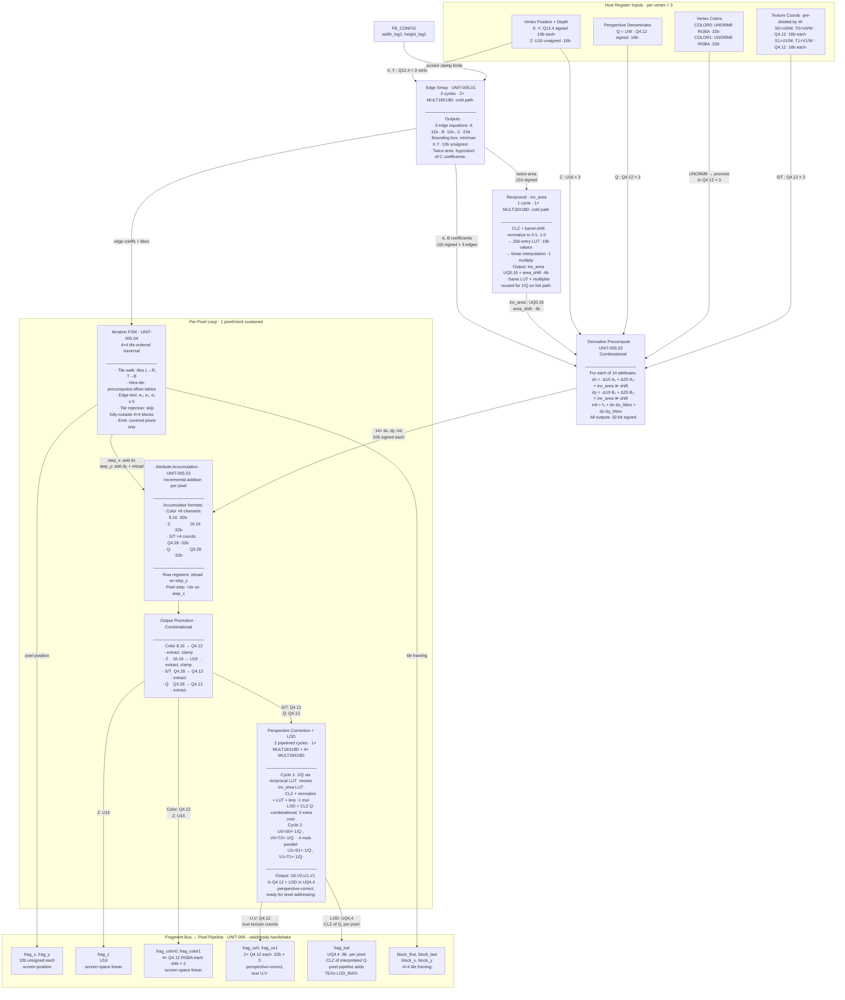

# Technical Report: Comprehensive Rasterizer Plan

Date: 2026-03-04
Status: Complete — ready for syskit impact analysis

## Background

The pico-gs rasterizer (UNIT-005) has undergone a series of rewrites aimed at resolving FPGA resource issues.
These rewrites, while solving the immediate resource problems, had the side effect of eroding the rasterizer's core responsibilities.
Critical features like perspective-correct attribute interpolation were progressively pushed out of the rasterizer and labeled "downstream issues," leaving the rasterizer's purpose and contract unclear.

This report investigates the current state of the rasterizer specifications and implementation, identifies where they have diverged from the intended design goals, and documents the findings as a foundation for a clean replacement of the rasterizer requirement and design documents:

- REQ-002 (Rasterizer) and its children REQ-002.01, REQ-002.02, REQ-002.03
- UNIT-005 (Rasterizer) and its sub-units UNIT-005.01 through UNIT-005.04

## Scope

### Questions This Report Investigates

1. What does the current rasterizer spec/design say, and where has it diverged from the stated architectural goals?
2. What is the minimal set of per-pixel attributes the rasterizer must output, and at what precision?
3. How can perspective-correct interpolation be achieved for texture coordinates with minimal multipliers?
4. How should 4x4 block-order traversal work, and what are the implications for the edge function and attribute evaluation?
5. What register interface changes are needed to remove the inverse area register and support the new approach?
6. Can SystemVerilog `interface` constructs be used for rasterizer I/O ports with the current Yosys/Verilator toolchain?

### Design Goals (Stated by User)

- **Perspective-correct interpolation for texture coordinates** — S/T (pre-divided by W) interpolated linearly, then corrected to true U/V within the rasterizer via per-pixel 1/Q multiplication
- **Screen-space linear interpolation for colors** — no C/W pre-multiplication; simpler pipeline, bounded visual error
- **4x4 block-order pixel output** to maximize cache and color write coalescing efficiency
- **No flat shading** — REQ-002.01 (Flat Shaded Triangle) is not required
- **Dedicated multipliers for perspective correction** — 7 MULT18X18D total: 2 edge setup, 1 reciprocal LUT, 4 parallel S/T×(1/Q)
- **One pixel per clock** throughput target
- **Remove the inverse area register** (AREA_SETUP) from required host inputs
- **Redefine UV to ST** if necessary (pre-perspective-divided texture coordinates)
- **Use explicit-wire port style** — SystemVerilog `interface` constructs are not viable with the current Yosys toolchain

### Out of Scope

- Pixel processing stages downstream of the rasterizer (texture fetch, color combining, alpha blend, dithering)
- Display controller and scanout
- Host-side vertex transformation and lighting pipeline
- Detailed RTL implementation (this report covers architecture and requirements only)

## Investigation

### 1. Current Specification Structure

The rasterizer is specified across seven documents:

**Requirements:**
- [REQ-002](../requirements/req_002_rasterizer.md): Top-level area grouping, allocates to UNIT-004/005/006/007
- [REQ-002.01](../requirements/req_002.01_flat_shaded_triangle.md): Flat shading (single color, no interpolation) — Priority: Important, Stability: Stable
- [REQ-002.02](../requirements/req_002.02_gouraud_shaded_triangle.md): Gouraud shading (screen-space linear color interpolation) — Priority: Important, Stability: Stable
- [REQ-002.03](../requirements/req_002.03_rasterization_algorithm.md): Core algorithm (edge functions, 1 pixel/clock, fragment bus format) — Priority: Essential, Stability: Stable

**Design:**
- [UNIT-005](../design/unit_005_rasterizer.md): Parent design unit with algorithm, sub-unit decomposition, DSP strategy
- [UNIT-005.01](../design/unit_005.01_edge_setup.md): Edge coefficient and bounding box computation (3 cycles)
- [UNIT-005.02](../design/unit_005.02_derivative_precomputation.md): Initial edge evaluation and per-attribute derivative computation (3 cycles)
- [UNIT-005.03](../design/unit_005.03_attribute_accumulation.md): Incremental accumulator stepping (per pixel, addition only)
- [UNIT-005.04](../design/unit_005.04_iteration_fsm.md): Bounding box walk, edge testing, fragment emission handshake

### 2. Current RTL Implementation

Four SystemVerilog modules implement UNIT-005:

| File | Purpose | Multipliers |
|------|---------|-------------|
| [rasterizer.sv](../../spi_gpu/src/render/rasterizer.sv) | FSM, shared 11x11 multiplier pair, vertex latches, edge setup | 2 MULT18X18D |
| [raster_deriv.sv](../../spi_gpu/src/render/raster_deriv.sv) | Combinational derivative precomputation using `inv_area` | Synthesized combinational (no DSP) |
| [raster_attr_accum.sv](../../spi_gpu/src/render/raster_attr_accum.sv) | Accumulator stepping and output promotion/clamping | None (addition only) |
| [raster_edge_walk.sv](../../spi_gpu/src/render/raster_edge_walk.sv) | Iteration position, edge functions, fragment bus packing | None (addition only) |

### 3. Current Register Interface

Rasterizer-relevant registers from [gpu_regs.rdl](../../registers/rdl/gpu_regs.rdl):

| Register | Index | Key Fields | Format |
|----------|-------|------------|--------|
| COLOR | 0x00 | COLOR0 [31:0], COLOR1 [63:32] | RGBA8888 UNORM8 each |
| UV0_UV1 | 0x01 | UV0_UQ/VQ [31:0], UV1_UQ/VQ [63:32] | Q4.12 per component |
| AREA_SETUP | 0x05 | INV_AREA [15:0], AREA_SHIFT [19:16] | UQ0.16 + 4-bit shift |
| VERTEX_* | 0x06-0x09 | X [15:0], Y [31:16], Z [47:32], Q [63:48] | Q12.4, Q12.4, U16, Q4.12 |

### 4. Current Fragment Output Bus

The rasterizer emits per-fragment data to UNIT-006 via valid/ready handshake (DD-025):

| Signal | Width | Format | Description |
|--------|-------|--------|-------------|
| frag_x | 10 bits | unsigned | Fragment X screen position |
| frag_y | 10 bits | unsigned | Fragment Y screen position |
| frag_z | 16 bits | unsigned | Interpolated depth |
| frag_color0 | 64 bits | Q4.12 RGBA (4x16) | Interpolated primary vertex color |
| frag_color1 | 64 bits | Q4.12 RGBA (4x16) | Interpolated secondary vertex color |
| frag_uv0 | 32 bits | Q4.12 {U[31:16], V[15:0]} | Interpolated texture coords unit 0 |
| frag_uv1 | 32 bits | Q4.12 {U[31:16], V[15:0]} | Interpolated texture coords unit 1 |
| frag_q | 16 bits | Q3.12 | Interpolated perspective denominator |

## Findings

### Finding 1: Traversal Order — Architecture and Implementation Contradict

ARCHITECTURE.md (line 48) states:
> "The rasterizer walks the bounding box in **4x4 tile order** -- aligned with the surface tiling and Z-cache block size -- all pixels within a tile are processed before advancing to the next, maximizing Z-cache locality."

However, every other document and the actual RTL implement **scanline order** (left-to-right, row-by-row):

- UNIT-005.04 design doc: "Drives the bounding box walk ... when stepping right, adds A coefficients ... when advancing to a new row, adds B coefficients"
- REQ-002.03: "emits fragments in scanline order (left-to-right)"
- RTL (`raster_edge_walk.sv` lines 208-219): `step_x` increments `curr_x` by 1; `step_y` resets `curr_x` to `bbox_min_x` and increments `curr_y` by 1

The ARCHITECTURE.md statement is aspirational but was never propagated to the requirements, design, or RTL.
The downstream memory system (UNIT-007, INT-011) uses 4x4 block-tiled SDRAM layout, meaning scanline-order fragment emission creates worst-case access patterns for the Z-buffer tile cache and framebuffer writes.

### Finding 2: Perspective Correction — Partially Implemented, Poorly Documented

The current design takes a hybrid approach that is not clearly articulated in any single document:

**What IS perspective-correct (partially):**
- UV texture coordinates: The removed host software (`pack_uv`) pre-multiplied U and V by 1/W before packing.
  The values in the UV0_UV1 register were therefore already s=u/w, t=v/w (i.e., "ST" format), even though the register names say "UV."
- Q (1/W) is interpolated as a scalar attribute and passed to UNIT-006 for downstream UV/Q division.

**What is NOT perspective-correct:**
- Colors (COLOR0, COLOR1) are UNORM8, interpolated linearly in screen space.
  REQ-002.02 explicitly says "interpolate color linearly across the triangle **in screen space**."
  There is no C/W pre-multiplication or post-interpolation perspective correction for colors.
- Depth (Z) is interpolated linearly in screen space.
  For perspective-correct Z, the host should submit 1/z (or z/w) and the pipeline should recover z via division, or z should be interpolated in clip space.
  The current design does neither.

**What the specs say vs what the RTL does:**
- UNIT-005 design doc lists Q/W as one of 13 interpolated attributes but never explains the perspective correction strategy.
- REQ-002.03 mentions Q in the fragment bus but does not explain how it enables perspective correction.
- No document describes the contract: "the rasterizer interpolates a/w linearly; downstream divides by interpolated 1/w to recover a."

### Finding 3: Q Format — Three Conflicting Definitions

The perspective-correction denominator Q (1/W) has inconsistent format definitions across the codebase:

| Source | Location | Claimed Format | Range |
|--------|----------|---------------|-------|
| Register RDL | `gpu_regs.rdl` line 196: `Q[63:48]` in VERTEX register | Q4.12 | +/-8.0 |
| RTL | `rasterizer.sv` line 44: `v0_q` port comment | Q3.12 | +/-4.0 |
| Old Software | Removed `pack_uv` function | Q1.15 | +/-1.0 |

Additionally, the old software packed Q into the UV0_UV1 register at bits [47:32] (the UV1_UQ field), **not** into the VERTEX register at bits [63:48] where the RDL defines it.
The RTL's `raster_edge_walk.sv` outputs `frag_q` by extracting bits [31:16] from the Q accumulator, treating it as "Q3.12" per its comment.

This three-way disagreement (Q4.12 vs Q3.12 vs Q1.15, VERTEX register vs UV0_UV1 register) is a concrete example of how the rewrites caused format drift.

### Finding 4: Inverse Area — Host Burden Not Implemented in Driver

The AREA_SETUP register (index 0x05) requires the host to compute:
1. The signed twice-area of the triangle from screen-space vertex positions
2. An `AREA_SHIFT` barrel-shift count (0-15) to keep the product in range
3. `INV_AREA = 65536 / (twice_area >> AREA_SHIFT)` as UQ0.16 fixed-point

The host must write this register before each vertex kick.
However, **the computation is not present in the current Rust driver crate** (the crates were recently removed per commit 40e607b, but even before removal, `submit_triangle` in `driver.rs` did not write AREA_SETUP).
The derivative module (`raster_deriv.sv`) uses `inv_area` and `area_shift` to scale all 13 per-attribute derivatives.

To remove this register, the rasterizer must compute the reciprocal internally.
The twice-area is already derivable from the edge C coefficients computed in UNIT-005.01.
A reciprocal LUT approach is feasible:

1. **Compute |2x area|** from edge setup (byproduct of C coefficient computation)
2. **Normalize** via count-leading-zeros (CLZ) + barrel shift to a fixed range
3. **LUT lookup** with 256 entries x 16-bit values (~0.5 EBR or distributed LUT)
4. **Optional refinement** via one Newton-Raphson iteration (1 multiply, reuses shared multiplier)
5. **Apply inverse shift** to produce the scaled reciprocal

This could fit within the existing 3-cycle cold-path setup window or add 1-2 additional setup cycles.
Since the SPI interface limits triangle throughput to one every ~72+ core cycles minimum, a few extra setup cycles have negligible impact on sustained performance.

### Finding 5: Flat Shading — Separate Requirement, Not Needed

REQ-002.01 (Flat Shaded Triangle) specifies a single-color rendering mode where one COLOR value from vertex 0 is used for all pixels.
The user has explicitly stated flat shading is not required.
Removing this requirement simplifies the rasterizer: all triangles always interpolate all attributes.
There is no need for a GOURAUD mode bit in RENDER_MODE to toggle between flat and interpolated shading.

### Finding 6: 4x4 Block Traversal — Feasible with Incremental Math

Switching from scanline to tile-ordered traversal changes the iteration pattern but preserves the addition-only inner loop:

**Tile traversal pattern:**
1. Align bounding box to 4x4 tile boundaries
2. For each tile (left-to-right, top-to-bottom in tile coordinates):
   a. Optionally: test tile corners against edge functions for early rejection (hierarchical test)
   b. For each pixel within the 4x4 tile (in a fixed intra-tile order):
      - Test edge functions
      - If inside, emit fragment with interpolated attributes
3. Between tiles: step accumulators by 4x dx (horizontal tile step) or 4x dy (vertical tile step)

**Intra-tile attribute evaluation (zero per-pixel multiplies):**
- Precompute per-tile: `dx_offset[0..3] = {0, dx, 2*dx, 3*dx}` and `dy_offset[0..3] = {0, dy, 2*dy, 3*dy}` — 4 additions total, once per tile
- Per-pixel: attribute at (x_off, y_off) within tile = `tile_corner_attr + dx_offset[x_off] + dy_offset[y_off]` — one addition from precomputed table

**Edge function tile stepping:**
- Same approach: precompute `A_offset[0..3]` and `B_offset[0..3]` for intra-tile pixel offsets
- Per-pixel edge test: `e_tile_corner + A_offset[x_off] + B_offset[y_off]` — one addition

**Tile-level early rejection:**
- If all four tile corners are outside the same edge, the entire tile can be skipped
- This is a common optimization that significantly reduces wasted edge tests for large triangles

**Output framing:**
- The user selected "covered pixels only" emission (no wasted cycles on empty pixels)
- Requires block framing signals so the downstream pixel pipeline knows which 4x4 tile is active
- Suggested signals: `block_x` (tile column), `block_y` (tile row), `block_first` (first pixel of tile), `block_last` (last pixel of tile)

### Finding 7: Color Interpolation Strategy — Screen-Space Linear (Decided)

On further analysis, perspective-correct color interpolation is not justified for this GPU.
The decision is to interpolate colors linearly in screen space, consistent with the current REQ-002.02 specification.

**Rationale:**

1. **Visual impact is bounded.**
   Perspective-correct interpolation matters most for texture coordinates, where even small errors cause visible texture "swimming" and seam artifacts.
   For Gouraud-shaded colors, the visual difference between screen-space and perspective-correct interpolation is subtle — it affects only the color gradient distribution across the triangle, not the vertex colors themselves.
   Many classic GPUs (PS1, Saturn, early PC accelerators) shipped with screen-space linear color interpolation and produced acceptable results.

2. **Register interface stays simple.**
   COLOR0 and COLOR1 remain UNORM8 (4×8 = 32 bits each), packed two-per-register in the existing 64-bit COLOR register (index 0x00).
   No format change, no additional registers, no host-side C/W pre-multiplication.

3. **Fewer downstream divisions.**
   The pixel pipeline (UNIT-006) must divide interpolated S/T by Q to recover true texture coordinates — 4 divisions for dual texture units.
   Without perspective-correct colors, the pipeline avoids 8 additional divisions per pixel (4 channels × 2 color sets).
   This is a significant saving in either division hardware or pipeline latency.

4. **Reduced attribute complexity.**
   Colors are interpolated as-is (UNORM8 promoted to Q4.12 for accumulator precision), without the C/W format transformation.
   The rasterizer setup path does not need to multiply color channels by per-vertex Q values (avoiding 24 extra setup multiplications).

**What this means for the rasterizer contract:**
- Texture coordinates: host submits S=U/W, T=V/W (pre-divided); rasterizer interpolates S, T, Q linearly, then computes U=S/(1/Q), V=T/(1/Q) internally; fragment bus carries true U, V ready for texel addressing (Finding 12).
  This is perspective-correct.
- Colors: host submits UNORM8 directly; rasterizer interpolates linearly in screen space; pixel pipeline uses colors as-is.
  This is NOT perspective-correct, by design.
- Q (1/W): interpolated linearly; consumed internally by the rasterizer for perspective correction; not present on the fragment bus.
- Z: interpolated linearly in screen space (see Finding 8 note).

### Finding 8: Attribute Count and Precision Summary

Under the proposed design (perspective-correct texture coords, screen-space linear colors, dual colors, dual texture coords), the full interpolated attribute set is:

| Attribute | Count | Per-Vertex Input Format | Accumulator Width | Output Format | Interpolation | Notes |
|-----------|-------|------------------------|-------------------|---------------|---------------|-------|
| S0 (= U0/W) | 1 | Q4.12 (16-bit signed) | 32-bit | Q4.12 (16-bit) | Linear (perspective-correct via Q) | Host pre-divides U by W |
| T0 (= V0/W) | 1 | Q4.12 (16-bit signed) | 32-bit | Q4.12 (16-bit) | Linear (perspective-correct via Q) | Host pre-divides V by W |
| S1 (= U1/W) | 1 | Q4.12 (16-bit signed) | 32-bit | Q4.12 (16-bit) | Linear (perspective-correct via Q) | Host pre-divides U by W |
| T1 (= V1/W) | 1 | Q4.12 (16-bit signed) | 32-bit | Q4.12 (16-bit) | Linear (perspective-correct via Q) | Host pre-divides V by W |
| Q (= 1/W) | 1 | Q4.12 (16-bit) | 32-bit | Q4.12 (16-bit) | Linear | Pixel pipeline divides S,T by Q |
| C0_R | 1 | UNORM8 (promoted to Q4.12) | 32-bit | Q4.12 (16-bit) | Screen-space linear | No perspective correction |
| C0_G | 1 | UNORM8 (promoted to Q4.12) | 32-bit | Q4.12 (16-bit) | Screen-space linear | No perspective correction |
| C0_B | 1 | UNORM8 (promoted to Q4.12) | 32-bit | Q4.12 (16-bit) | Screen-space linear | No perspective correction |
| C0_A | 1 | UNORM8 (promoted to Q4.12) | 32-bit | Q4.12 (16-bit) | Screen-space linear | No perspective correction |
| C1_R | 1 | UNORM8 (promoted to Q4.12) | 32-bit | Q4.12 (16-bit) | Screen-space linear | No perspective correction |
| C1_G | 1 | UNORM8 (promoted to Q4.12) | 32-bit | Q4.12 (16-bit) | Screen-space linear | No perspective correction |
| C1_B | 1 | UNORM8 (promoted to Q4.12) | 32-bit | Q4.12 (16-bit) | Screen-space linear | No perspective correction |
| C1_A | 1 | UNORM8 (promoted to Q4.12) | 32-bit | Q4.12 (16-bit) | Screen-space linear | No perspective correction |
| Z | 1 | 16-bit unsigned | 32-bit | 16-bit unsigned | Screen-space linear | See note below |
| **Total** | **14** | | | | | |

**Note on Z:** Z is interpolated linearly in screen space.
Many GPUs (including PS1, N64) use this approach because the error is bounded and the simplicity is preferred.
Perspective-correct Z would require interpolating z/w and dividing by Q in the pixel pipeline — adding another division for marginal benefit at low resolutions.
The new specification should document this as an explicit design choice.

**Perspective correction summary:**
- 4 attributes are perspective-correct (S0, T0, S1, T1) — the rasterizer interpolates these linearly, then multiplies by 1/Q internally to produce true U, V (Finding 12)
- 1 attribute enables perspective correction (Q) — interpolated linearly, consumed internally by the rasterizer; does not appear on the fragment bus
- 9 attributes are screen-space linear (8 color channels + Z) — passed through directly to the pixel pipeline

### Finding 9: Current Multiplier Budget

The current rasterizer uses:
- **2 MULT18X18D** blocks for the shared 11x11 setup multiplier pair (edge C coefficients + initial edge evaluation)
- **Combinational multipliers** in `raster_deriv.sv` for derivative computation (synthesized to logic, not dedicated DSP)

The ECP5-25K has 28 MULT18X18D blocks total.
Current allocation per ARCHITECTURE.md: rasterizer (2-4), color combiner (4-6), texture decoders (2-4 per decoder).

**Reciprocal LUT precision analysis (Decided: linear-interpolated LUT, no Newton-Raphson):**

The internal reciprocal replaces the removed AREA_SETUP register.
It operates on the cold path only (once per triangle setup); the per-pixel inner loop remains pure addition regardless of approach.
One-pixel-per-clock throughput is unaffected.

The twice-area is normalized via CLZ + barrel shift to `x ∈ [0.5, 1.0)`.
A 256-entry LUT indexed by the top 8 fractional bits stores `1/x` values:

| Approach | Worst-case relative error | Resources | Setup cycles |
|----------|--------------------------|-----------|-------------|
| Nearest-entry lookup (no interpolation) | ~0.4% (at x ≈ 0.5, where 1/x curvature is highest) | 256×16-bit LUT only | 0 extra |
| Linear interpolation between adjacent entries | ~0.0008% (second-order residual) | 256×16-bit LUT + 1 multiply (reuses shared multiplier) | 1 extra |
| Newton-Raphson refinement | ~0.0001% | 1 additional MULT18X18D or reuse shared | 2 extra |

**Error propagation for nearest-entry (worst case, no interpolation):**
A 0.4% error in `inv_area` produces a 0.4% error in all dx/dy derivatives.
For a large triangle spanning 512 pixels with a full-range Q4.12 gradient, the accumulated error at the far edge is approximately `0.004 × 1.0 = 0.004` in Q4.12 units — about 1 LSB of the 12-bit fractional part.
This is at the threshold of visibility for texture coordinates (possible 1-texel shimmer on large triangle edges) but invisible for colors (sub-1/256 channel error).

**Decision: 256-entry LUT with linear interpolation.**
Linear interpolation achieves ~0.0008% error — orders of magnitude better than needed — using only 1 cold-path multiply through the existing shared multiplier.
This is simpler than Newton-Raphson (no iterative multiply-subtract-multiply sequence), adds 0 MULT18X18D blocks, and costs only 1 additional setup cycle.
Newton-Raphson is not justified given the interpolated LUT's precision margin.

### Finding 10: SystemVerilog Interface Constructs — Not Viable with Current Toolchain

Defining explicit SystemVerilog `interface` constructs for the rasterizer's input and output buses was investigated as a way to formalize the port contracts and reduce wiring boilerplate in `gpu_top.sv`.

**Verilator (simulation/linting): Good support.**
Verilator 5.045 handles interfaces and modports well for the standard synthesis-targeted patterns this project would use.
No blocking issues.

**Yosys (synthesis): Two blocking bugs.**

1. **`default_nettype none` incompatibility** — Yosys issue [#1053](https://github.com/YosysHQ/yosys/issues/1053) (open since 2019, still unresolved as of Yosys 0.61).
   Interface member signals trigger "implicitly declared" warnings that become hard errors under `` `default_nettype none ``.
   Every `.sv` file in `spi_gpu/src/` uses this directive — removing it would weaken lint safety across the entire RTL.

2. **Multi-bit interface ports silently truncated to 1 bit** — Yosys issue [#3592](https://github.com/YosysHQ/yosys/issues/3592) (still open).
   Wider fields in interface declarations (e.g., `logic [15:0]`) are silently narrowed to 1-bit wires during synthesis.
   For a rasterizer output bus with 16-bit color and coordinate fields, this would cause silent data corruption — catastrophic and hard to debug.

**Workarounds considered:**

| Approach | Pros | Cons |
|----------|------|------|
| sv2v preprocessor | Well-tested; flattens interfaces to plain wires before Yosys sees them | Adds Haskell/Stack build dependency; not currently installed; requires Makefile integration |
| yosys-slang plugin | Full IEEE 1800-2017 support including interfaces | Version compatibility lag; additional build dependency |
| Avoid SV interfaces | Zero risk; consistent with existing codebase style | More verbose wiring in `gpu_top.sv` |

**Decision: Use explicit-wire port style (option 3).**
The risk/reward ratio does not justify adding a preprocessing step or alternative frontend.
The project can achieve most of the documentation benefit through `typedef struct packed` definitions (which Yosys handles correctly) to group related signals into named bundles, even though the module ports remain individual wires.

### Finding 11: Rectangle Primitives (VERTEX_KICK_RECT)

The register interface includes `VERTEX_KICK_RECT` (index 0x09) for axis-aligned rectangle rasterization.
The current design describes this as using two vertices as opposite corners.
Under the proposed tile-ordered traversal, rectangles map naturally to sequences of complete 4x4 tiles (with partial tiles at edges), which is highly efficient for clear operations and UI rendering.
The new specification should preserve this capability.

### Finding 12: Perspective Correction Belongs in the Rasterizer (Decided)

The earlier analysis (Findings 2, 7, 8) assumed the rasterizer would output raw S, T, Q values and the pixel pipeline (UNIT-006) would divide S/T by Q to recover true texture coordinates U, V.
On closer examination, this is the wrong split of responsibilities.

**Why the pixel pipeline is the wrong place for this division:**

1. **The pixel pipeline has no reciprocal unit.**
   UNIT-006 is designed to receive Q4.12 UV coordinates and use them directly for texel addressing.
   There is no division hardware in the pixel pipeline hot path.
   Adding one would require new DSP blocks in an already resource-constrained module.

2. **Texture sampling is the first pixel pipeline stage after early-Z.**
   The UV coordinates must be ready *before* the texture cache lookup.
   Inserting a reciprocal + 4 multiplies before the first stage adds pipeline latency that delays every fragment — not just a throughput cost, but a latency cost that increases the gap between rasterization and framebuffer write.

3. **The pixel pipeline also targets 1 pixel/clock.**
   It is not a multi-cycle-per-pixel design that can absorb extra stages for free.
   Every additional stage before texture fetch is a stage that must be pipelined and adds to the critical path.

4. **The rasterizer has idle multipliers during pixel emission.**
   The 2 MULT18X18D blocks used for edge setup sit unused during the entire pixel walk.
   Adding dedicated per-pixel multipliers for the S/T→U/V correction is a natural use of the rasterizer's DSP budget.

**Rasterizer DSP allocation (decided: 7 MULT18X18D total):**

| Purpose | Count | Path | Notes |
|---------|-------|------|-------|
| Edge C coefficients | 2 | Cold (triangle setup) | Shared pair, existing design |
| Reciprocal LUT interpolation | 1 | Cold: inv_area; Hot: 1/Q | Shared between setup and per-pixel paths |
| S/T × (1/Q) perspective correction | 4 | Hot (per pixel, parallel) | S0, T0, S1, T1 simultaneously |
| **Total** | **7** | | |

**Per-pixel perspective correction pipeline (2 cycles):**

1. **Cycle 1:** Compute 1/Q via reciprocal LUT (CLZ + normalize + 256-entry LUT + linear interpolation using the dedicated reciprocal multiplier).
   Same LUT and multiplier used for inv_area during triangle setup — no conflict since cold and hot paths are mutually exclusive.
2. **Cycle 2:** Multiply S0×(1/Q), T0×(1/Q), S1×(1/Q), T1×(1/Q) in parallel through 4 dedicated multipliers.
   Output: U0, V0, U1, V1 in Q4.12 — ready for texel addressing.

Sustained throughput remains **1 pixel/clock** after a 1-cycle pipeline bubble at the start of each triangle.
The 4 parallel multipliers ensure the correction does not become a throughput bottleneck.

**Fragment bus changes:**

- `frag_uv0`, `frag_uv1` now carry **true U, V** texture coordinates in Q4.12 — perspective-correct, ready for the texture sampler.
- `frag_q` is **removed** from the fragment bus — Q is consumed internally by the rasterizer and is no longer needed downstream.
- The pixel pipeline contract is preserved: it receives Q4.12 UV coordinates exactly as designed.

**LOD (level-of-detail) for mipmapping — per-pixel from interpolated Q:**

Since Q = 1/W is already interpolated per pixel, `log2(W) = -log2(Q) = log2(1/Q)` provides a per-pixel distance-based LOD for essentially zero hardware cost.
This is the same approach used by the PS2 Graphics Synthesizer.

**Implementation (combinational, zero multipliers, zero extra cycles):**

Q is available from the output promotion stage as Q4.12 (16-bit, positive for visible fragments since W > 0 after near-plane clipping).
For Q ∈ (0, 1] (the common case where W ≥ 1), the integer bits are zero and the LOD is derived from the fractional bits:

| Q (= 1/W) | Binary (bits 11:0) | Leading zeros | LOD_int |
|-----------|-------------------|---------------|---------|
| 0.5 (W=2) | 100000000000 | 0 | 0 |
| 0.25 (W=4) | 010000000000 | 1 | 1 |
| 0.125 (W=8) | 001000000000 | 2 | 2 |
| 0.0625 (W=16) | 000100000000 | 3 | 3 |

- **Integer LOD:** CLZ (count leading zeros) on the Q magnitude bits — a priority encoder, pure combinational logic.
- **Fractional LOD:** The bits immediately after the leading 1 give the trilinear blend fraction — a barrel shift or mux, also purely combinational.

**LOD bias for texture scale:**

The raw `log2(W)` captures only distance.
To select the correct mip level, the pixel pipeline adds a per-texture `LOD_BIAS` from the existing `TEXn_CFG` register.
The host computes this bias during texture setup based on texture dimensions and UV mapping scale (analogous to the PS2 GS's K/L LOD parameters).

```
final_LOD = CLZ_derived_LOD + TEXn_CFG.LOD_BIAS
```

This is a single addition in the pixel pipeline — trivial.

**Compared to derivative-based LOD:**

| Approach | Per-pixel? | Hardware cost | Captures oblique angles? |
|----------|-----------|---------------|-------------------------|
| Derivative-based (quotient rule) | Per-triangle at best | Multiple multiplies | Yes (anisotropic ratio) |
| Q-based CLZ | Per-pixel | Zero (combinational) | No (isotropic only) |

The Q-based approach is strictly better for this GPU class: it varies correctly with perspective across the triangle, costs nothing, and the anisotropic case it misses is well out of scope.

**Fragment bus LOD output:**

`frag_lod` carries the integer + fractional CLZ-derived LOD per pixel.
A compact format such as UQ4.4 (8-bit: 4-bit integer for up to 16 mip levels, 4-bit fraction for trilinear blending) is likely sufficient.
The pixel pipeline adds `TEXn_CFG.LOD_BIAS` and clamps to the texture's available mip range.

## Proposed Rasterizer Data Flow

The following diagram synthesizes all findings and decisions into a single view of the proposed rasterizer pipeline.
It shows every input with its fixed-point format, the transformation at each pipeline stage, the accumulator formats in the per-pixel inner loop, and the final fragment bus output to the pixel pipeline.



**Key observations from the diagram:**

- **Cold path** (once per triangle): Edge setup (2 muls) → inv_area reciprocal (1 mul) → derivative precompute.
  7 MULT18X18D total; cold path reuses the reciprocal LUT multiplier that the hot path also uses.
- **Hot path** (per pixel): Accumulation via addition → output promotion → perspective correction + LOD.
  The 1/Q LUT + 4 parallel S/T multiplies are pipelined over 2 cycles; LOD (CLZ of Q) is derived combinationally in cycle 1 at zero extra cost.
  Sustained throughput is 1 pixel/clock.
- **Format boundary:** UNORM8 color inputs are promoted to Q4.12 at derivative computation; all accumulation and output uses Q4.12 uniformly (except Z which stays U16).
- **Perspective correction is complete at the rasterizer boundary.**
  The fragment bus carries true U, V texture coordinates — the pixel pipeline receives them ready for texel addressing, exactly as its current design expects.
  Q is consumed internally and does not appear on the fragment bus.
  Colors remain screen-space linear by design (Finding 7).

## Conclusions

### Answers to Scoping Questions

**Q1: Where has the spec diverged from architectural goals?**
The most significant divergence is the traversal order: ARCHITECTURE.md specifies 4x4 tile order, but the requirements (REQ-002.03), design (UNIT-005.04), and RTL all implement scanline order.
Additionally, perspective correction is only partially specified — UV coordinates happen to be pre-divided in the old software, but this is not documented as a requirement, and colors are explicitly screen-space linear.
The Q format has three conflicting definitions across the register spec, RTL, and old software.

**Q2: What is the minimal attribute set and precision?**
14 attributes interpolated internally (see Finding 8): 4 perspective-divided texture coordinates (S0, T0, S1, T1), 1 perspective denominator (Q), 8 screen-space linear color channels (C0 RGBA, C1 RGBA), and 1 screen-space linear depth (Z).
Accumulators need 32-bit width to prevent drift over large triangles.
The rasterizer consumes S/T and Q internally to produce perspective-correct U/V (Finding 12).
The fragment bus outputs 14 values: 4 true texture coordinates (U0, V0, U1, V1), 8 color channels, Z, and per-pixel LOD — all in Q4.12 except Z (U16) and LOD (UQ4.4).
Q is consumed internally and does not appear on the fragment bus; LOD is derived from Q via CLZ at zero cost (Finding 12).

**Q3: How to achieve perspective-correct interpolation with minimal multipliers?**
Perspective correction applies only to texture coordinates (S0, T0, S1, T1), not to colors.
The approach: host pre-divides U,V by W to produce S,T; rasterizer interpolates S,T and Q linearly via incremental addition; rasterizer then computes 1/Q per pixel via reciprocal LUT and multiplies S×(1/Q) to produce true U,V (Finding 12).
Total rasterizer DSP budget: 7 MULT18X18D — 2 for edge setup (cold path), 1 for reciprocal LUT interpolation (shared cold/hot), 4 for parallel S/T correction (hot path).
The pixel pipeline requires no changes — it receives Q4.12 UV coordinates ready for texel addressing, exactly as currently designed.

**Q4: How should 4x4 block traversal work?**
Tile-aligned bounding box, tile-raster-order traversal (tiles left-to-right, top-to-bottom), with all pixels within a tile processed before advancing.
Intra-tile attribute evaluation uses precomputed offset tables (4 additions per tile, 1 addition per pixel) — no per-pixel multiplies.
Emit only covered pixels, with block framing signals for downstream pipeline.
Hierarchical tile rejection (test tile corners) skips fully-outside tiles.

**Q5: What register changes are needed?**
- Remove AREA_SETUP register (index 0x05) — rasterizer computes reciprocal internally
- UV0_UV1 register name stays as-is — the host writes S/T (pre-divided by W) but the rasterizer outputs true U/V, so "UV" accurately describes the fragment bus contract
- Resolve Q format to a single canonical definition (Q4.12 per the RDL) and ensure it lives in the VERTEX register; Q is consumed internally by the rasterizer and removed from the fragment bus
- COLOR register (index 0x00) remains unchanged — UNORM8 format, two colors packed per 64-bit register (resolved, see Finding 7)

### Decisions Made

1. **Color interpolation: screen-space linear** (Finding 7).
   Colors remain UNORM8, interpolated linearly in screen space.
   No C/W pre-multiplication, no downstream Q division for colors.
   Register interface unchanged.

2. **Z interpolation: screen-space linear** (Finding 8 note).
   Z is interpolated linearly in screen space, consistent with PS1/N64 approach.
   Bounded error at low resolutions; avoids an additional division in the pixel pipeline.

3. **SystemVerilog interfaces: not used** (Finding 10).
   Yosys bugs with `default_nettype none` and multi-bit port truncation are blocking.
   Continue with explicit-wire port style; use `typedef struct packed` for documentation benefit where appropriate.

4. **Reciprocal LUT: 256-entry with linear interpolation** (Finding 9).
   ~0.0008% worst-case relative error — orders of magnitude better than needed.
   Single LUT + multiplier shared between cold-path inv_area and hot-path 1/Q.
   Newton-Raphson is not justified.

5. **Perspective correction in the rasterizer, not the pixel pipeline** (Finding 12).
   The rasterizer computes 1/Q per pixel via the reciprocal LUT and multiplies S×(1/Q) to produce true U,V using 4 parallel MULT18X18D.
   Total rasterizer DSP budget: 7 MULT18X18D (2 edge setup + 1 reciprocal + 4 S/T correction).
   Sustained throughput: 1 pixel/clock (2-cycle pipeline for 1/Q + multiply).
   Fragment bus carries true U,V in Q4.12 — pixel pipeline contract unchanged.
   Q is removed from the fragment bus; per-pixel LOD is derived from CLZ of Q at zero extra cost (Finding 12).
   The pixel pipeline adds a per-texture LOD_BIAS to select the correct mip level.

### What Remains Uncertain

1. **ECP5 resource impact:** Whether the combinational multipliers in `raster_deriv.sv` need to be converted to DSP blocks, and whether the reciprocal LUT fits in distributed LUT or requires an EBR.
   The 7 MULT18X18D rasterizer budget is a deliberate allocation; the total system DSP budget will be reviewed after trimming in other areas.
2. **Intra-tile pixel ordering:** Whether pixels within a 4x4 block should emit in row-major order, column-major, Z-order (Morton curve), or some other pattern optimized for downstream access.
3. **LOD_BIAS register field:** The `TEXn_CFG` register needs a `LOD_BIAS` field (signed, ~Q4.4 or similar) for the pixel pipeline to add to the rasterizer's CLZ-derived LOD.
   The exact bit width and whether min/max LOD clamp fields are also needed are pixel pipeline design concerns.

## Recommendations

1. **Use `/syskit-impact` to analyze the full change scope.**
   All major design decisions are now resolved.
   The changes touch REQ-002.x, UNIT-005.x, UNIT-004 (triangle setup — removes inv_area passthrough), and INT-010 (register map — AREA_SETUP removal).
   UNIT-006 (pixel pipeline) is **not** affected — the fragment bus UV contract is preserved; Q is removed from the bus (simplifying the interface), and the pixel pipeline no longer needs any division hardware for perspective correction.

2. **Define `typedef struct packed` bundles for the rasterizer output bus.**
   While SV `interface` constructs are not viable with Yosys, packed struct typedefs can formalize the fragment bus format in a way that is both synthesizable and self-documenting.
   Define these in a shared package that both the rasterizer and pixel pipeline import.

3. **Review total system DSP budget after rasterizer allocation.**
   The rasterizer now claims 7 MULT18X18D (up from 2).
   The total ECP5-25K budget of 28 blocks must be re-evaluated across the color combiner, texture decoders, and alpha blend units.
   Some existing DSP allocations in other modules may be speculative and trimmable.

## Recommended Implementation Phases

This redesign is too large for a single syskit flow.
A single `syskit-propose` touching ~10 documents across three specification tiers produces a changeset that is difficult to review, and a single `syskit-plan` produces an overwhelming task list.
The following phased approach orders changes so that each phase builds on stable contracts established by the previous one.

### Phase 1: Register Interface and Requirement Cleanup

**Scope:** Set the foundation — define contracts and clean up obsolete requirements before redesigning the rasterizer internals.

**Specification changes:**
- **INT-010** (register map): Remove AREA_SETUP register (index 0x05); resolve Q format to canonical Q4.12 in the VERTEX register definition.
- **REQ-002.01** (flat shading): Remove — explicitly not required per design goals.
- **REQ-002.02** (Gouraud shading): Update to document screen-space linear color interpolation as an explicit design choice (Finding 7), not a limitation.
- **REQ-002.03** (rasterization algorithm): Update traversal order from scanline to 4x4 tile order; redefine fragment bus format — remove `frag_q`, add `frag_lod` (UQ4.4), change UV semantics to true perspective-correct U/V coordinates.
- **REQ-002** (parent): Update sub-requirement list to reflect REQ-002.01 removal.

**Why first:** Requirements and interface contracts must be stable before writing the design that implements them.
The register change (AREA_SETUP removal) also unblocks the reciprocal LUT design in Phase 2.

**syskit workflow:** `/syskit-impact` → `/syskit-propose` → `/syskit-approve` → `/syskit-plan` → `/syskit-implement`

### Phase 2: Rasterizer Design Rewrite (UNIT-005.x)

**Scope:** Replace all rasterizer design documents with the new architecture defined by this report.

**Specification changes:**
- **UNIT-005** (parent): New algorithm overview, DSP budget (7 MULT18X18D), pipeline stage decomposition, cold/hot path description.
- **UNIT-005.01** (edge setup): Add internal reciprocal LUT computation (CLZ + 256-entry LUT + linear interpolation) that replaces host-computed inv_area.
- **UNIT-005.02** (derivative precompute): Update to use internally computed reciprocal; document 14-attribute derivative set with formats.
- **UNIT-005.03** (attribute accumulation): 14 attributes with specified accumulator widths (32-bit); document output promotion and clamping to fragment bus formats.
- **UNIT-005.04** (iteration FSM): 4x4 tile-ordered traversal with hierarchical tile rejection; perspective correction pipeline (2-cycle 1/Q + S/T multiply); LOD derivation via CLZ; block framing signals.

**RTL implementation:** This phase includes rewriting the four rasterizer SystemVerilog modules ([rasterizer.sv](../../spi_gpu/src/render/rasterizer.sv), [raster_deriv.sv](../../spi_gpu/src/render/raster_deriv.sv), [raster_attr_accum.sv](../../spi_gpu/src/render/raster_attr_accum.sv), [raster_edge_walk.sv](../../spi_gpu/src/render/raster_edge_walk.sv)) plus the reciprocal LUT module and updated testbenches.

**Why second:** The Phase 1 requirements and fragment bus contract are now approved and stable.
The design units can reference the updated REQ-002.x requirements directly.

**syskit workflow:** `/syskit-impact` → `/syskit-propose` → `/syskit-approve` → `/syskit-plan` → `/syskit-implement`

### Phase 3: Integration and Upstream/Downstream Updates

**Scope:** Align surrounding components and architecture documentation with the new rasterizer.

**Specification changes:**
- **UNIT-004** (triangle setup): Remove inv_area passthrough; confirm vertex packing matches updated register definitions.
- **ARCHITECTURE.md**: Align traversal order description (already says 4x4 tile — verify consistency with new REQ-002.03); update DSP budget table; update fragment bus description.
- **UNIT-006** (pixel pipeline) interface: Document Q removal from fragment bus (simplification, no functional change); add `LOD_BIAS` field to `TEXn_CFG` register in INT-010 if not already present; document LOD computation contract (`final_LOD = rasterizer_LOD + LOD_BIAS`).

**Why third:** Integration changes depend on both the requirements (Phase 1) and the rasterizer design (Phase 2) being finalized.
UNIT-006 changes are minimal — the pixel pipeline contract is preserved by design.

**syskit workflow:** `/syskit-impact` → `/syskit-propose` → `/syskit-approve` → `/syskit-plan` → `/syskit-implement`

### Phase Summary

| Phase | Documents | Nature | Dependency |
|-------|-----------|--------|------------|
| 1 — Contracts | REQ-002.x, INT-010 | Requirement + interface cleanup | None |
| 2 — Design | UNIT-005.x | Rasterizer architecture rewrite + RTL | Phase 1 approved |
| 3 — Integration | UNIT-004, UNIT-006, ARCHITECTURE.md | Upstream/downstream alignment | Phase 2 approved |

Each phase is a self-contained syskit flow (impact → propose → approve → plan → implement) with a focused review scope of 3–5 documents.
